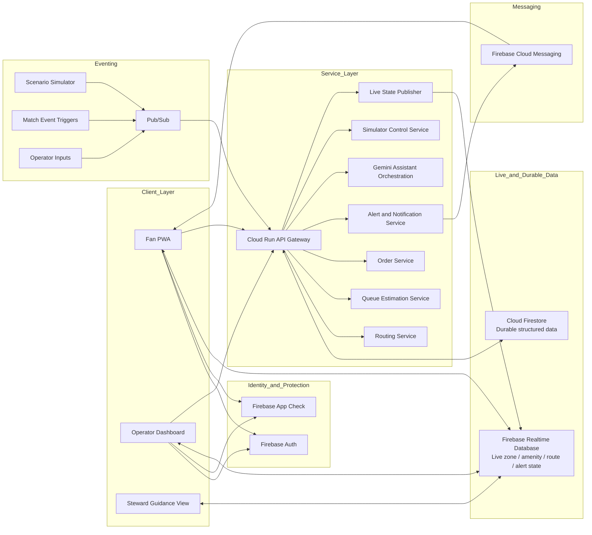
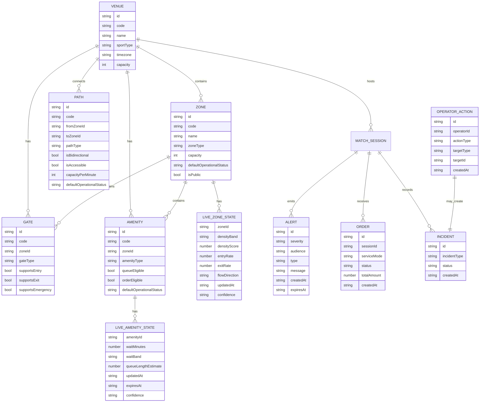
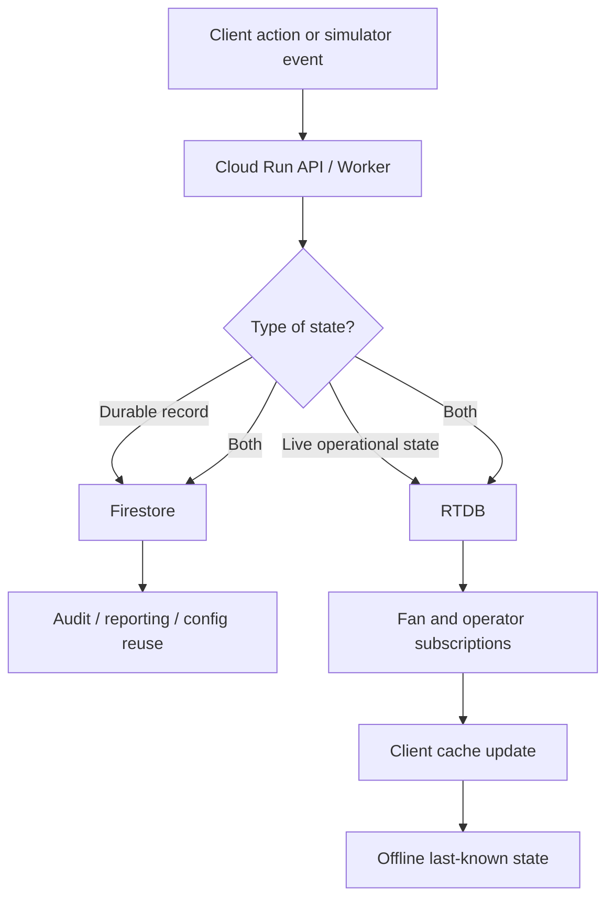
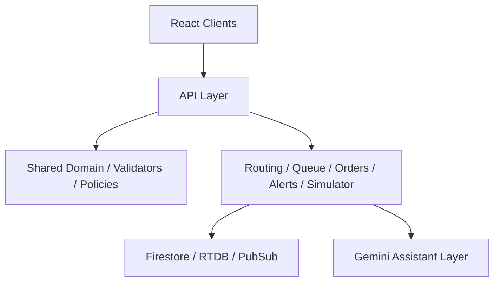

# MatchFlow Software Design Document (SDD)

## 1. Header & Metadata

| Field | Value |
|---|---|
| Document Title | MatchFlow Software Design Document (SDD) |
| Project Name | MatchFlow |
| Product Stage | Challenge-scoped MVP |
| Version | v1.0 |
| Status | Draft |
| Date | 2026-04-08 |
| Author(s) | Lead Engineer / Architect |
| Audience | Engineering, architecture, AI coding agents, reviewers |
| Related Documents | `BRD.md`, `PRD.md`, `docs/architecture/SRS.md`, `docs/architecture/architecture-overview.md`, `docs/architecture/decisions.md`, `skills.md`, `agents.md`, `.ai/templates/spec.md` |
| Traceability | PRD defines product behavior; SRS defines technical requirements; this SDD defines implementation design, internal structure, contracts, and operational patterns |

### Terminology note
This document uses **MVP** terminology in line with the approved MatchFlow reclassification note. MatchFlow should be framed as a **challenge-scoped MVP**, not merely as a proof of concept.

### Link to PRD / SRS
- PRD: `PRD.md`
- SRS: `docs/architecture/SRS.md`
- Architecture Overview: `docs/architecture/architecture-overview.md`
- Decisions: `docs/architecture/decisions.md`

---

## 2. Introduction

### 2.1 Purpose of the software
MatchFlow is a cricket-aware smart stadium assistant and operations platform built as a rapid MVP for large cricket venues. It is designed to help fans and stadium operators respond better to predictable crowd surges during innings breaks, DRS spikes, wickets, and end-of-match dispersal.

The software combines:
- fan-facing route and queue guidance
- operator-facing crowd visibility and controls
- a zone-based digital twin
- live queue and congestion state
- in-seat ordering flows
- emergency rerouting
- offline-capable degraded behavior
- simulator-driven scenario validation

### 2.2 Purpose of this SDD
This SDD translates the product and system requirements into a concrete implementation design. It is the execution-facing architecture document that explains:
- how the system is decomposed into modules and services
- how data is stored, published, cached, and secured
- how API interfaces should behave
- how critical flows such as routing, queue estimation, emergency mode, and offline sync should be implemented
- which architectural alternatives were considered and why the current design was chosen

### 2.3 Scope of this SDD
This SDD covers the MatchFlow MVP implementation design for:
- fan web/PWA application
- operator dashboard
- backend API and worker services
- live state publishing
- simulation/event processing
- routing and queue decision services
- data storage, caching, and observability
- testing and release-quality controls

This SDD does not define full production rollout hardening for:
- sensor-heavy integrations
- CCTV/computer vision
- full CAD/BIM digital twin ingestion
- production indoor positioning
- production-grade payment integrations
- broad enterprise back-office workflows

### 2.4 Technical definitions

| Term | Definition |
|---|---|
| Zone | Primary crowd-management unit in the venue graph. |
| Amenity | Fan-facing utility point such as concession, washroom, water point, help desk, or first aid. |
| Path | Traversable connection between zones used for convenience and emergency routing. |
| Digital Twin | Simplified graph-based representation of the venue using zones, paths, gates, amenities, capacities, and closures. |
| Live State | Fast-changing operational state such as density, queue band, closures, alerts, and active scenario. |
| Durable State | Long-lived structured records such as venue metadata, menu items, orders, thresholds, and audit logs. |
| Outbox | Client-side pending action queue for retries after connectivity recovery. |
| Surge Window | High-pressure match moment such as innings break, DRS spike, wicket surge, or end-match rush. |
| RTDB | Firebase Realtime Database, used for live state fan-out. |
| FCM | Firebase Cloud Messaging, used for push delivery where enabled. |

### 2.5 Design principles
1. **Zone-first over seat-first** — the MVP operates on zones, not seat-level tracking.
2. **Centralized decision state** — queue and route intelligence are computed centrally, not ad hoc in each client.
3. **Offline-first for critical fan utility** — last-known guidance remains usable during degraded connectivity.
4. **Safety-first protected workflows** — emergency and operator actions must be validated server-side.
5. **Believable MVP scope** — the design favors a coherent, stable working slice over overbuilt enterprise depth.
6. **Spec-Driven Development compatibility** — all modules should be buildable in narrow, testable slices.

---

## 3. System Architecture (The Big Picture)

### 3.1 High-level architecture



### 3.2 Recommended runtime topology
- **Frontend**
  - `apps/fan-pwa`
  - `apps/ops-dashboard`
- **Shared domain and utilities**
  - `packages/domain`
  - `packages/shared-types`
  - `packages/ui`
  - `packages/utils`
- **Service modules**
  - `services/api`
  - `services/routing`
  - `services/queue`
  - `services/alerts`
  - `services/orders`
  - `services/simulator`
  - `services/assistant`

### 3.3 Tech stack

| Layer | Chosen Stack |
|---|---|
| Fan UI | React + TypeScript + PWA patterns |
| Operator UI | React + TypeScript |
| Backend runtime | Cloud Run |
| Live state | Firebase Realtime Database |
| Durable data | Cloud Firestore |
| Event pipeline | Pub/Sub |
| Notifications | Firebase Cloud Messaging |
| Authentication | Firebase Auth |
| Client protection | Firebase App Check |
| AI assistive layer | Gemini |
| Design workflow | Google Stitch |
| Build workflow | Spec-Driven Development with Antigravity / AI-assisted slices |

### 3.4 Infrastructure design

| Concern | Design Choice | Why |
|---|---|---|
| Hosting | Firebase Hosting or equivalent static web hosting | Fast deployment for web/PWA surfaces |
| Compute | Cloud Run services and workers | Fast to ship, autoscaling, low infra overhead |
| Event ingestion | Pub/Sub | Clean simulator and event fan-out model |
| Live updates | RTDB subscriptions | Lightweight, low-latency fan-out for compact objects |
| Durable records | Firestore | Flexible structured storage for metadata and transactions |
| Push delivery | FCM | Native fit for fan alerts where used |
| Secrets and service config | Environment variables + cloud-managed secrets | Keeps sensitive data out of client code |

### 3.5 Infrastructure stance
For the MVP, MatchFlow uses a **managed-cloud, serverless/container-lite approach** rather than Kubernetes or deep custom infrastructure. This reduces delivery friction and preserves demo stability.

---

## 4. Data Design (The Brain)

### 4.1 Data ownership model

| Data Category | Store | Notes |
|---|---|---|
| Venue topology | Firestore or static seed bootstrap | Stable graph structure with immutable IDs |
| Live zone state | RTDB | Density, flow, status band, freshness, confidence |
| Live amenity queue state | RTDB | Wait estimate/band, queue length, freshness |
| Active alerts | RTDB | In-app state, fan-safe and ops-relevant |
| Current route outputs | RTDB and/or API response cache | Context-specific route guidance |
| Orders | Firestore | Transaction-like state transitions |
| Menu/catalog | Firestore | Durable but lightweight |
| Operator audit trail | Firestore | Critical for protected actions |
| Simulator scenarios/config | Firestore | Durable scenario definitions |
| Client offline cache | IndexedDB/localStorage | Last-known state, outbox, fan context |

### 4.2 Logical domain entities



### 4.3 Suggested Firestore collections

```text
/venues/{venueId}
/venues/{venueId}/zones/{zoneId}
/venues/{venueId}/gates/{gateId}
/venues/{venueId}/amenities/{amenityId}
/venues/{venueId}/paths/{pathId}

/matches/{matchId}
/matches/{matchId}/config
/matches/{matchId}/menuItems/{menuItemId}
/matches/{matchId}/orders/{orderId}
/matches/{matchId}/scenarios/{scenarioId}
/matches/{matchId}/audit/{auditId}
/matches/{matchId}/incidents/{incidentId}
```

### 4.4 Suggested RTDB paths

```text
live/{matchId}/zones/{zoneId}
live/{matchId}/amenities/{amenityId}
live/{matchId}/alerts/{alertId}
live/{matchId}/routes/{routeContextId}
live/{matchId}/ops/summary
live/{matchId}/scenario/current
live/{matchId}/closures/zones/{zoneId}
live/{matchId}/closures/paths/{pathId}
```

### 4.5 Data flow



### 4.6 Caching strategy

#### Client-side caching
- Use **IndexedDB** for structured offline cache and pending outbox.
- Use **localStorage** only for lightweight session preferences or simple UI state if needed.
- Cache:
  - last-known seat/stand context
  - last-known nearby amenity summary
  - last-known route guidance
  - current cart and pending order intent
  - emergency guidance snapshot

#### Server-side caching
- Prefer **RTDB itself as the live shared cache** for centrally computed state.
- Avoid introducing Redis/Memorystore in the first MVP cut unless performance pain appears.
- Keep route and queue responses compact and easy to recompute.

#### Cache policy
- Use **stale-while-revalidate** semantics in the fan UI.
- When exact wait values become stale, degrade to `low`, `moderate`, or `high` bands.
- Always surface `updatedAt` or freshness labels for user trust.

---

## 5. Interface / API Design

### 5.1 API design principles
- All protected actions go through Cloud Run APIs.
- Read-heavy fan views should favor RTDB subscriptions for live state plus targeted API calls for route or order actions.
- APIs should return explicit typed payloads rather than loose generic blobs.
- Emergency and operator workflows must be auditable.

### 5.2 Core endpoint set

| Method | Path | Purpose |
|---|---|---|
| GET | `/api/v1/matches/:matchId/context` | Return match, venue, and lightweight fan context bootstrap |
| GET | `/api/v1/matches/:matchId/amenities/nearby` | Return nearby amenities with live queue summary |
| POST | `/api/v1/routes/compute` | Compute preferred and fallback route |
| GET | `/api/v1/matches/:matchId/orders/menu` | Return simplified menu |
| POST | `/api/v1/matches/:matchId/orders` | Place an order |
| GET | `/api/v1/matches/:matchId/orders/:orderId` | Fetch order status |
| POST | `/api/v1/ops/alerts` | Publish operator alert |
| POST | `/api/v1/ops/closures` | Close or reopen path/zone |
| POST | `/api/v1/ops/emergency/activate` | Enter emergency mode |
| POST | `/api/v1/ops/emergency/deactivate` | Exit emergency mode |
| POST | `/api/v1/simulator/scenarios/:scenarioId/start` | Start simulator scenario |
| POST | `/api/v1/simulator/scenarios/:scenarioId/stop` | Stop simulator scenario |
| GET | `/api/v1/ops/summary` | Return operator summary snapshot |

### 5.3 Example request / response payloads

#### Route compute request
```json
{
  "matchId": "match_20260408_001",
  "sourceZoneId": "zone_north_stand",
  "targetType": "amenity",
  "targetId": "amenity_concession_east_1",
  "routePolicy": "convenience",
  "clientContext": {
    "networkMode": "online",
    "accessibilityNeeds": {
      "avoidStairs": true
    }
  }
}
```

#### Route compute response
```json
{
  "routeId": "route_ctx_4812",
  "status": "ok",
  "policy": "convenience",
  "recommended": {
    "pathZoneIds": [
      "zone_north_stand",
      "zone_north_concourse",
      "zone_central_circulation",
      "zone_east_concourse"
    ],
    "etaSeconds": 240,
    "etaBand": "3-5 min",
    "reason": "Lower queue pressure and open accessible path"
  },
  "fallback": {
    "available": true,
    "pathZoneIds": [
      "zone_north_stand",
      "zone_west_concourse",
      "zone_central_circulation",
      "zone_east_concourse"
    ],
    "etaSeconds": 300
  },
  "freshness": {
    "updatedAt": "2026-04-08T18:15:30Z",
    "confidence": "medium"
  }
}
```

#### Nearby amenities response
```json
{
  "matchId": "match_20260408_001",
  "sourceZoneId": "zone_north_stand",
  "amenities": [
    {
      "amenityId": "amenity_washroom_north_1",
      "name": "Washroom - North Concourse",
      "amenityType": "washroom",
      "waitBand": "moderate",
      "waitMinutes": 4,
      "updatedAt": "2026-04-08T18:15:12Z",
      "recommended": false
    },
    {
      "amenityId": "amenity_washroom_east_1",
      "name": "Washroom - East Concourse",
      "amenityType": "washroom",
      "waitBand": "low",
      "waitMinutes": 2,
      "updatedAt": "2026-04-08T18:15:08Z",
      "recommended": true
    }
  ]
}
```

#### Place order request
```json
{
  "matchId": "match_20260408_001",
  "seatContext": {
    "standZoneId": "zone_north_stand",
    "seatLabel": "N-12-08"
  },
  "serviceMode": "pickup",
  "items": [
    {
      "menuItemId": "menu_samosa_combo",
      "quantity": 2
    }
  ],
  "clientRequestId": "req_fan_0012"
}
```

#### Place order response
```json
{
  "orderId": "order_00918",
  "status": "accepted",
  "serviceMode": "pickup",
  "tracking": {
    "state": "preparing",
    "updatedAt": "2026-04-08T18:17:10Z"
  }
}
```

#### Emergency activation request
```json
{
  "matchId": "match_20260408_001",
  "reason": "Crowd pressure near Gate B",
  "closures": {
    "zoneIds": ["zone_gate_b_buffer"],
    "pathIds": ["path_east_concourse_to_gate_b_buffer"]
  }
}
```

#### Emergency activation response
```json
{
  "status": "accepted",
  "emergencyMode": true,
  "incidentId": "incident_20260408_07",
  "updatedAt": "2026-04-08T18:20:00Z"
}
```

### 5.4 Authentication and authorization

#### Fan context
- Fan-facing read experiences may work without hard login for the MVP if the deployment uses public-state subscriptions plus optional anonymous/session identity.
- Fan write actions such as ordering should use client identity or a lightweight session token if implemented.

#### Operator context
- Operator APIs require **Firebase Auth** identity token verification.
- Operator role checks must be enforced server-side.
- Emergency/closure/alert endpoints require explicit role authorization.

#### Client protection
- Use **Firebase App Check** for public clients where practical.
- Never trust role or privilege claims passed only in the request body.

---

## 6. Component / Module Detail

### 6.1 Application modules

| Module | Responsibility | Key Inputs | Key Outputs |
|---|---|---|---|
| Fan App Shell | Fan match center, routes, amenities, orders, alerts | RTDB state, route API, order API | UI actions, pending outbox items |
| Ops Dashboard | Heatmap, pressure overview, controls, simulator | RTDB ops state, protected APIs | operator commands |
| Venue Domain Package | Static topology, selectors, validators | venue seed/config | graph-ready model |
| Routing Service | Preferred/fallback route computation | topology, closures, pressure state, policy | route response |
| Queue Service | Amenity wait-state computation | simulator events, density, overrides | live amenity state |
| Alert Service | Alert generation and publishing | incidents, thresholds, ops actions | RTDB alerts, FCM messages |
| Order Service | Menu retrieval, order placement, order state | client order input | Firestore order record, tracking state |
| Simulator | Synthetic match/crowd events | scenario commands | Pub/Sub events, state changes |
| Live State Publisher | Writes compact live objects | derived state | RTDB objects |
| Assistant Layer | Explanations and recommendations | authoritative state | summarized guidance |

### 6.2 Service layer separation



#### Separation rules
- UI must not embed routing or queue logic directly.
- Domain validators and selectors should be reusable by services and tests.
- Service modules must be testable outside the UI.
- Protected operator actions must flow through the API layer and audit pipeline.

### 6.3 Logic breakdown — route computation

```text
INPUT: sourceZoneId, targetType, targetId, policy, accessibility flags
1. Load venue topology and active closures.
2. Build traversable graph for the current policy.
3. Remove closed or restricted edges not allowed by policy.
4. Apply pressure weighting from live zone state.
5. Apply accessibility filters if required.
6. Compute preferred route using explainable weighted shortest-path logic.
7. Attempt fallback route by excluding the primary critical edge set or using alternate amenity target.
8. Return route, ETA band, explanation, freshness, and fallback if available.
```

### 6.4 Logic breakdown — queue estimation

```text
INPUT: amenity activity events, surge scenario, zone density, operator overrides
1. Aggregate recent activity for each amenity.
2. Blend current activity with scenario pressure multiplier.
3. Adjust queue estimate using parent zone density and path congestion.
4. Map numerical estimate to wait band.
5. Stamp updatedAt, expiresAt, and confidence.
6. Publish compact amenity live state to RTDB.
```

### 6.5 Logic breakdown — emergency mode propagation

```text
INPUT: operator command to activate emergency mode with closures
1. Verify operator identity and authorization.
2. Persist incident and audit record in Firestore.
3. Update active closures and emergency mode state.
4. Recompute affected route guidance using emergency policy.
5. Publish fan-safe emergency instructions and updated route state to RTDB.
6. Publish operator summary updates.
7. Trigger high-priority alert distribution.
```

### 6.6 Third-party integrations

| Integration | Role | MVP Treatment |
|---|---|---|
| Firebase Auth | Identity and operator access control | Required |
| Firebase App Check | Client protection | Strongly preferred |
| RTDB | Live state distribution | Required |
| Firestore | Durable structured storage | Required |
| Pub/Sub | Simulator/event pipeline | Required |
| FCM | Push notifications | Optional but recommended if time permits |
| Gemini | Assistant explanations and summary recommendations | Optional/assistive, never authoritative |
| Payment gateway | Real payment processing | Not included in MVP; mocked/simulated |

---

## 7. Non-Functional Technical Specs

### 7.1 Performance

#### Target response times
| Operation | Target |
|---|---|
| Fan app initial shell render | under 2.5 seconds on a typical mobile network |
| Nearby amenities API response | under 500 ms server time for cached/live-backed response |
| Route compute response | under 800 ms for MVP graph size |
| Operator control action acknowledgement | under 1 second perceived response |
| Live state propagation after simulator/ops event | typically within 1–3 seconds |

#### Concurrency expectations
- Support demo-ready concurrency for **hundreds to low thousands of live viewers** in a challenge environment.
- Design should scale to **10x more live subscribers** primarily through RTDB fan-out, compact payloads, and Cloud Run autoscaling.

### 7.2 Scalability
- Keep live payloads zone-level rather than granular per-user tracking.
- Use Cloud Run horizontal autoscaling for API and workers.
- Use Pub/Sub to buffer and smooth event spikes.
- Partition live state by `matchId` and entity category.
- Keep route computation stateless so instances can scale horizontally.
- Treat Redis/Memorystore as deferred unless actual bottlenecks appear.

### 7.3 Availability and reliability
- The MVP should remain usable even if some live data becomes stale.
- Safety guidance must degrade gracefully rather than disappear.
- Critical fan flows should keep working from last-known state under poor connectivity.
- Operator commands must either succeed atomically or fail clearly without partial unsafe UI state.

### 7.4 Security
- All traffic must use HTTPS/TLS in transit.
- Use cloud-provider encryption at rest for managed services.
- Keep secrets out of client bundles and source control.
- Enforce server-side authorization for emergency, closure, and operator alert actions.
- Validate and sanitize all command payloads.
- Persist operator audit records for protected actions.
- Avoid precise individual location collection in the MVP.

### 7.5 Observability

#### Minimum required signals
- route computation count, latency, and failures
- queue estimation refresh count and staleness rate
- emergency mode toggles
- operator closure/alert actions
- simulator scenario start/stop and event throughput
- order status changes and failed retries
- client outbox retry failures where practical

#### Logging and monitoring approach
- Structured JSON logs from Cloud Run services.
- Cloud Logging for centralized log storage.
- Cloud Monitoring dashboards for service health and latency.
- Error tracking for frontend and backend exceptions.
- Basic alerting on repeated service failures or elevated route/queue computation errors.

---

## 8. Testing & Quality Assurance

### 8.1 Unit testing
Test isolated logic for:
- venue graph validation
- path traversability
- route weighting and fallback selection
- queue band mapping
- stale-state degradation logic
- order state transitions
- authorization guards and policy checks

### 8.2 Integration testing
Test service interactions for:
- API + Firestore order flow
- API + RTDB route publishing
- simulator event -> queue/zone update propagation
- emergency activation -> closures -> alerts -> route changes
- operator auth token validation on protected endpoints

### 8.3 Scenario / simulator testing
Use simulator-backed validation for:
- innings break surge
- DRS spike
- wicket movement surge
- end-match exit rush
- emergency closure and reroute

### 8.4 Load and stress testing
Before MVP freeze, run lightweight load tests for:
- route compute endpoint burst traffic
- live subscription update frequency under surge simulation
- operator action bursts during active scenarios

#### Load-test objective
Confirm that the app remains responsive and stable under the highest expected demo load, not to certify full production scale.

### 8.5 Manual verification checklist
- Fan can view queue state and freshness from the match center.
- Fan can receive a preferred and fallback route where applicable.
- Fan app still shows last-known guidance offline.
- Operator can trigger a closure or emergency mode and see propagation.
- Simulator scenarios visibly affect heatmap, queue state, and routing.
- Emergency messaging overrides convenience messaging.
- UI remains readable in high-density/high-alert states.

### 8.6 Quality gates
A slice is only ready when:
- build/typecheck passes
- relevant automated tests pass
- manual validation succeeds
- no obvious regressions are introduced
- docs/contracts are updated where behavior changed
- the demo path remains stable

---

## 9. Alternatives Considered (The Why)

### 9.1 Firestore-only live state
**Alternative:** Use only Firestore for both durable and live state.

**Rejected because:**
- frequent live crowd and queue fan-out is better suited to RTDB in this MVP design
- it blurs the separation between durable records and fast-changing operational state

**Chosen instead:** RTDB for live operational state, Firestore for durable structured data.

### 9.2 Seat-level digital twin
**Alternative:** Model fan location and route guidance at seat/block precision.

**Rejected because:**
- increases complexity sharply
- requires integrations and data fidelity beyond MVP scope
- adds privacy and realism risks without improving challenge credibility enough

**Chosen instead:** zone-based digital twin with believable graph routing.

### 9.3 Client-side routing and queue computation
**Alternative:** Compute queue recommendations and best routes directly in the client.

**Rejected because:**
- risks inconsistent decisions across clients
- increases duplicated logic
- weakens control over safety and operational behavior

**Chosen instead:** centrally computed state and server-side route decisions with client subscription and rendering.

### 9.4 Kubernetes / microservice-heavy backend
**Alternative:** Deploy multiple microservices on Kubernetes from the start.

**Rejected because:**
- too heavy for the MVP timeline
- increases deployment and debugging overhead
- does not improve demo value proportionately

**Chosen instead:** modular Cloud Run services with clear internal separation.

### 9.5 Redis / Memorystore introduced immediately
**Alternative:** Add dedicated cache infrastructure from day one.

**Rejected because:**
- unnecessary at the initial MVP scale
- adds operational complexity without clear near-term benefit

**Chosen instead:** use RTDB as the live shared cache and defer Redis unless proven necessary.

### 9.6 Real payment gateway integration
**Alternative:** Add production-grade payment flow for in-seat ordering.

**Rejected because:**
- outside challenge-scoped MVP need
- adds test and compliance overhead
- distracts from crowd-flow value story

**Chosen instead:** mocked or simulated payment-free ordering flow.

### 9.7 Gemini as the primary decision engine
**Alternative:** Let Gemini drive route or safety decisions directly.

**Rejected because:**
- safety and routing need deterministic, explainable, policy-controlled logic
- LLM output should not become authoritative for operational commands

**Chosen instead:** Gemini is assistive and explanatory on top of authoritative system state.

---

## 10. Implementation Notes for SDD Execution

### 10.1 Recommended feature build order
1. `01-venue-domain-model`
2. `02-fan-app-shell`
3. `03-live-heatmap`
4. `04-queue-alerts`
5. `05-in-seat-ordering`
6. `06-emergency-reroute`
7. `07-offline-sync`
8. `08-demo-simulator`

### 10.2 Delivery discipline
All work should follow:
- one spec
- one task
- one verification
- one review
- one commit

### 10.3 Safe failure principles
- If live state is missing, show last-known useful state.
- If queue precision is stale, degrade to broad queue band.
- If route computation fails, show best nearby options and a clear status message.
- If protected action fails, do not show a false-success state.
- If connectivity drops during ordering, preserve the pending action in the outbox.

---

## 11. Summary
MatchFlow’s SDD defines a practical MVP implementation design built around:
- two web surfaces: fan and operator
- a zone-based digital twin
- RTDB for live operational state
- Firestore for durable structured records
- Cloud Run services for APIs and decision logic
- Pub/Sub-driven simulation and event processing
- protected operator workflows
- offline-first client behavior
- deterministic routing and queue intelligence
- assistive, non-authoritative Gemini support

This design is intentionally modular, testable, and aligned to Spec-Driven Development so the MatchFlow MVP can be built credibly in small, reviewable slices.
