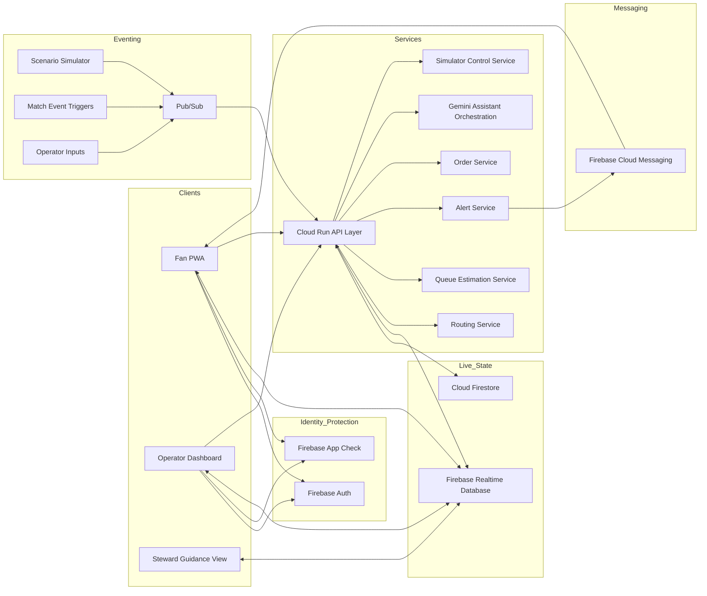
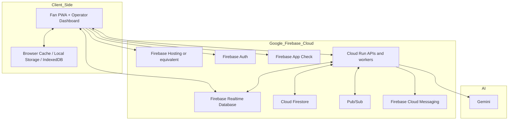
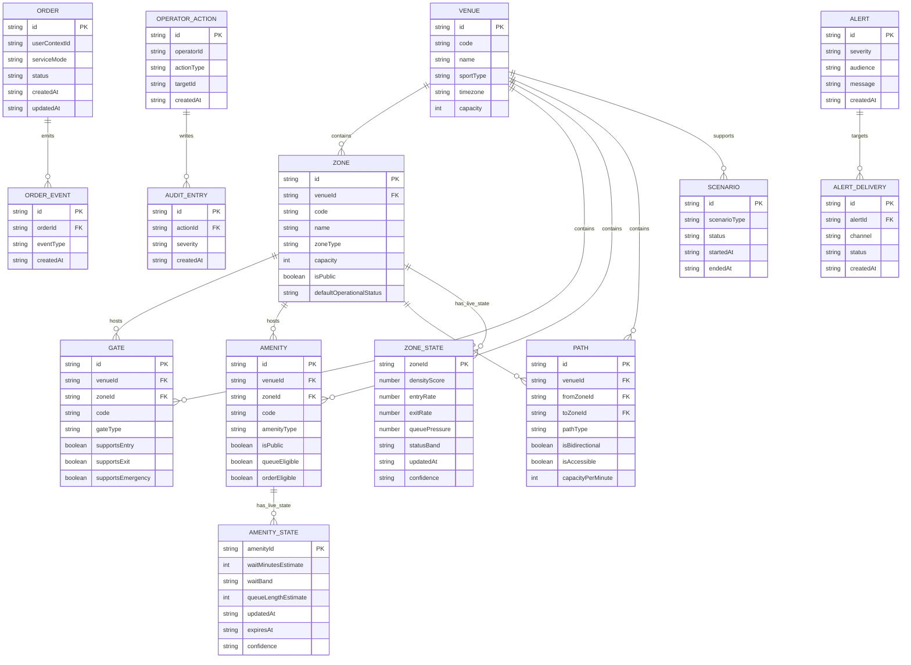
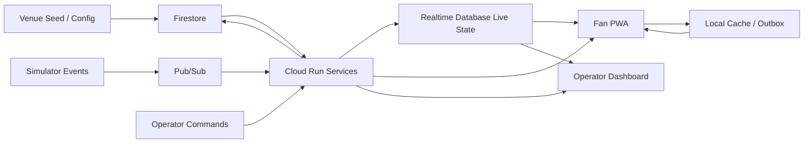

# MatchFlow Software Requirements Specification (SRS)

## Document Metadata

| Field | Value |
|---|---|
| Document Title | MatchFlow Software Requirements Specification |
| Product | MatchFlow |
| Version | v1.0 |
| Status | Draft |
| Date | 2026-04-08 |
| Audience | Product owner, solution architect, engineers, AI coding agents, reviewers |
| Related Documents | BRD, PRD, Architecture Overview, Decisions, Build Rules and SDD Working Method, future DESIGN.md and feature specs |
| Delivery Mode | 72-hour smart stadium MVP |
| Primary Method | Spec-Driven Development (SDD) |

---

## 1. Introduction

### 1.1 Purpose of the software

MatchFlow is a cricket-aware smart stadium system that provides real-time crowd-flow intelligence for fans and stadium operators. It is intended to reduce crowd friction during innings breaks, DRS spikes, wickets, and end-of-match exits through zone-level routing, queue-aware guidance, in-seat ordering, emergency rerouting, and offline-capable behavior.

This SRS defines the technical execution blueprint and system constraints for the MatchFlow MVP. It translates the product and architecture direction into implementable software requirements, service boundaries, data contracts, runtime behavior, and non-functional targets.

### 1.2 Scope of this SRS

This SRS covers:
- system structure and deployment model
- data and state ownership
- technical behavior of major modules
- runtime flows and integration points
- non-functional requirements for performance, security, scalability, accessibility, and resilience
- data model and storage shape
- error handling and recovery expectations

This SRS does not commit MatchFlow to production-grade sensor integration, CAD/BIM ingestion, precise indoor positioning, or seat-level live tracking.

### 1.3 Intended use

This document should be used as the technical source of truth for:
- feature spec creation
- implementation slicing
- service and data-contract design
- test planning
- demo hardening
- architecture review

### 1.4 Technical definitions

| Term | Definition |
|---|---|
| Zone | The primary crowd-management unit in the digital twin. Examples: stand, concourse, gate buffer, exit plaza. |
| Amenity | A fan-relevant point such as a concession, washroom, water point, help desk, or first aid. |
| Path | A traversable link between zones used for normal or emergency routing. |
| Digital Twin | A simplified graph-based spatial model of the stadium using zones, paths, gates, amenities, closures, and capacities. |
| Live State | Fast-changing operational state such as zone pressure, amenity wait band, active alerts, closures, and current scenario. |
| Durable State | Structured records that must persist beyond transient live updates, such as venue topology, order records, menu data, and audit logs. |
| Surge Window | A short high-pressure operating moment such as innings break, DRS, wicket-related rush, or end-match exit. |
| PWA | Progressive Web App used for the fan-facing mobile experience. |
| RTDB | Firebase Realtime Database used for compact live state distribution. |
| Firestore | Cloud Firestore used for durable structured records and configuration. |
| Cloud Run | Managed runtime used for API and backend services. |
| Pub/Sub | Messaging layer used to fan out simulator and event-processing workloads. |
| Outbox | Client-side queue of pending user actions that could not be synced immediately. |
| Confidence | A quality indicator describing how trustworthy a computed live value is. |

### 1.5 Constraints carried into the SRS

- MatchFlow is a 72-hour MVP and must remain small, believable, modular, and demo-ready.
- Stadium modeling must stay zone-based rather than seat-tracking-based.
- Live behavior should be driven by centrally computed state and simulation, not by heavy hardware dependencies.
- Offline-first behavior is mandatory for critical fan flows.
- Operator-only actions must be protected and validated server-side.

---

## 2. System Architecture

### 2.1 Architectural overview

MatchFlow is a Google-native, event-informed smart stadium system with five core runtime areas:

1. **Fan Experience Layer** — mobile-first PWA for fan utility.
2. **Operator Experience Layer** — dashboard for crowd monitoring and intervention.
3. **Realtime State Layer** — central live state published to subscribed clients.
4. **Service and Decision Layer** — Cloud Run services for routing, queueing, alerts, orders, and assistant logic.
5. **Simulation and Event Layer** — scenario engine used for believable cricket-specific surge behavior.

### 2.2 High-level architecture diagram

### 2.3 Primary components and responsibilities

| Component | Responsibility |
|---|---|
| Fan PWA | Show amenities, queue bands, routes, alerts, order flow, and emergency guidance. |
| Operator Dashboard | Show zone heat state, amenity pressure, alerts, closures, and simulator controls. |
| Venue Domain Model | Provide the graph-based digital twin: venue, zones, gates, amenities, paths, capacities, and status defaults. |
| Routing Service | Compute normal and emergency routes using graph topology, closures, and pressure weighting. |
| Queue Estimation Service | Produce centrally computed amenity wait state and queue bands. |
| Alert Service | Publish in-app and optional push notifications. |
| Order Service | Support a lightweight in-seat ordering flow with simple status transitions. |
| Simulator Control Service | Start and stop demo scenarios; manage simulator inputs and scenario state. |
| Pub/Sub Pipeline | Transport simulator and event messages into processing flows. |
| RTDB | Store fast-changing, fan-safe and ops-relevant live state. |
| Firestore | Store durable structured records, configuration, topology, order history, and audit data. |
| Firebase Auth | Authenticate operator actions and role-aware access. |
| Firebase App Check | Protect public clients from abusive or unauthorized app access. |
| Gemini Layer | Generate assistant-style explanations and contextual suggestions on top of authoritative state. |

### 2.4 Deployment architecture

### 2.5 State ownership model

| State Category | Source of Truth | Examples |
|---|---|---|
| Authoritative live state | Backend + RTDB | zone pressure, amenity wait state, active alerts, active closures, emergency mode, current scenario |
| Durable structured state | Firestore | venue topology, menu data, orders, thresholds, simulator definitions, audit trails |
| Local client cache | Device/browser | last-known route, last-known queue state, cart, seat/stand context, pending outbox |
| Derived assistant output | Cloud Run + Gemini | user-facing explanation, timing suggestion, operator summary insight |

### 2.6 Technical architecture rules

- Clients must not compute their own authoritative queue state.
- Clients must not become the source of truth for dangerous operational state.
- Live state should remain compact and zone-level.
- Services must be modular and independently testable.
- Firebase access should be isolated behind service boundaries or adapters where practical.

---

## 3. Functional Technical Requirements

### 3.1 Venue domain model

**SRS-FR-01** The system shall maintain a zone-based venue topology.

**Inputs**
- seed venue configuration
- durable venue metadata
- manual configuration updates

**Processing**
- validate zones, gates, amenities, paths, and references
- expose helpers/selectors for route computation and lookups
- maintain stable IDs usable by live overlays and simulator events

**Outputs**
- validated venue graph
- queryable domain entities
- reusable route-ready topology

**Technical constraints**
- topology shall remain zone-based
- no seat-level live tracking
- no CAD/BIM dependency
- static topology and live overlays must remain separated

### 3.2 Fan app shell

**SRS-FR-02** The system shall provide a mobile-first fan shell optimized for quick decision-making.

**Inputs**
- seat/stand context
- nearby live amenity state
- route responses
- alerts and scenario state
- offline cache

**Processing**
- render match-aware home
- render nearby amenities with queue indicators
- render route summaries and freshness indicators
- preserve critical context locally

**Outputs**
- usable fan interface under normal and degraded connectivity
- clearly prioritized next-best actions

### 3.3 Live heat map and zone state

**SRS-FR-03** The system shall compute and publish zone-level operational state.

**Inputs**
- simulator events
- operator inputs
- match moment triggers
- derived queue pressure

**Processing**
- calculate density band
- calculate pressure score and confidence
- apply closures and scenario overlays
- publish timestamped live state objects to RTDB

**Outputs**
- operator-visible zone heat state
- fan-safe localized guidance where relevant

**Minimum live zone fields**
- zoneId
- densityScore
- entryRate
- exitRate
- queuePressure
- statusBand
- updatedAt
- confidence

### 3.4 Queue alerts and amenity guidance

**SRS-FR-04** The system shall compute amenity wait state centrally and publish it to clients.

**Inputs**
- amenity activity events
- zone pressure
- scenario modifiers
- operator overrides

**Processing**
- estimate wait time or wait band
- compute freshness and expiry
- identify better nearby options when available
- publish wait state updates to RTDB

**Outputs**
- wait estimate or band
- queue length estimate
- freshness timestamp
- confidence
- recommendation context

**Minimum live amenity fields**
- amenityId
- amenityType
- zoneId
- waitMinutesEstimate
- waitBand
- queueLengthEstimate
- confidence
- updatedAt
- expiresAt

### 3.5 Dynamic routing

**SRS-FR-05** The system shall compute routes using the venue graph and current operational state.

**Inputs**
- source zone or stand context
- target type or target ID
- closures
- zone pressure weights
- route policy (`normal`, `low_pressure`, `emergency_exit`)

**Processing**
- resolve source and target nodes/zones
- evaluate traversable graph edges
- apply exclusion rules for closed or restricted paths
- apply weighting for congestion or emergency routing
- produce best route and optional fallback route

**Outputs**
- route steps or route path IDs
- ETA estimate or band
- fallback route if available
- explanation metadata
- route freshness metadata

### 3.6 In-seat ordering

**SRS-FR-06** The system shall support a lightweight order flow suitable for a believable MVP.

**Inputs**
- menu catalog
- seat/stand context
- cart items
- selected service mode
- order placement request

**Processing**
- validate basic order payload
- persist order record
- assign simple status lifecycle
- allow pending-sync behavior when offline

**Outputs**
- order confirmation
- order status state
- recoverable retry flow when offline

**Allowed order states**
- `draft`
- `pending_sync`
- `placed`
- `accepted`
- `preparing`
- `ready`
- `fulfilled`
- `failed`
- `cancelled`

### 3.7 Notifications and alerts

**SRS-FR-07** The system shall generate short, actionable notifications.

**Inputs**
- surge scenarios
- queue spikes
- closures
- emergency mode activation
- operator-issued alerts

**Processing**
- prioritize messages by severity
- suppress low-priority noise where appropriate
- publish in-app alerts to RTDB
- optionally send push via FCM

**Outputs**
- fan alert cards
- operator alerts
- emergency banner state

### 3.8 Emergency rerouting and control plane

**SRS-FR-08** The system shall support protected emergency actions and closure-aware routing.

**Inputs**
- authenticated operator commands
- selected path/zone closures
- emergency mode toggle

**Processing**
- validate operator authorization
- persist audit record
- update closures
- recompute affected routes
- publish emergency alert state

**Outputs**
- updated live closure state
- rerouted guidance
- emergency banner state
- operator audit log entry

### 3.9 Offline-first behavior

**SRS-FR-09** The system shall remain usable under weak or no connectivity for critical fan flows.

**Inputs**
- cached shell state
- cached nearby amenity state
- cached route state
- pending user actions

**Processing**
- load local cache first when network is unavailable
- degrade exact values to coarse bands when stale
- queue unsent actions in local outbox
- retry when connectivity returns

**Outputs**
- usable cached view
- freshness labels
- pending action indicators
- successful recovery after reconnect

### 3.10 Simulator

**SRS-FR-10** The system shall include a simulator capable of generating believable cricket-specific operating scenarios.

**Inputs**
- scenario start/stop command
- scenario configuration
- seed topology
- scenario timing and intensity settings

**Processing**
- generate event sequences for surge windows
- update zone and amenity pressure through event pipeline
- produce route-impacting closure or emergency events
- publish scenario state to RTDB and processing services

**Required scenarios**
- innings break rush
- DRS spike
- wicket surge
- end-match exit rush
- emergency closure scenario

**Outputs**
- scenario state
- event messages
- updated live zone and amenity state
- demo-ready operator and fan impact

### 3.11 Operator dashboard

**SRS-FR-11** The system shall provide an authenticated operator dashboard.

**Inputs**
- live zone state
- live amenity state
- active alerts
- scenario state
- operator actions

**Processing**
- display hotspot summary
- surface closures and emergency state clearly
- provide quick action controls
- send protected commands through backend APIs

**Outputs**
- readable command-and-control experience
- low-friction action flows
- timestamped decision support

### 3.12 Role and access control

**SRS-FR-12** The system shall enforce role-aware separation between fan and operator capabilities.

**Inputs**
- authenticated identity
- role claims
- requested action or endpoint

**Processing**
- verify auth state
- verify operator role for protected actions
- reject unauthorized actions
- expose only safe client-visible state to fan users

**Outputs**
- allowed action
- rejected action with controlled error response
- audit entry for sensitive command paths where appropriate

---

## 4. Non-Functional Requirements

### 4.1 Performance requirements

The following are engineering targets for the MatchFlow MVP and should be treated as design-time performance goals rather than hard production SLAs.

| Area | Target |
|---|---|
| Fan app initial shell load on warm network | <= 3 seconds |
| Fan app load from local cache in offline mode | <= 2 seconds |
| Operator dashboard initial useful render | <= 4 seconds |
| Route computation API p95 | <= 1500 ms |
| Queue-state read API or compute path p95 | <= 1200 ms |
| Live state propagation to subscribed clients under normal load | <= 3 seconds typical |
| Operator closure/emergency action reflected in fan and ops state | <= 5 seconds typical |
| Order placement acknowledgement p95 | <= 2 seconds when online |
| Simulator scenario start to visible UI impact | <= 5 seconds typical |

#### Concurrent user capacity targets for MVP

| User Type | Target |
|---|---|
| Fan concurrent connected sessions | 5,000 |
| Operator concurrent sessions | 50 |
| Steward/shared guidance sessions | 200 |
| Scenario event rate | sufficient to sustain surge demos without UI instability |

#### Performance rules
- payloads should stay compact and zone-level
- aggressive client polling should be avoided
- surge-mode updates may increase in cadence, but must remain bounded
- the app must remain responsive during simulator-driven rushes

### 4.2 Security requirements

#### Authentication and authorization
- Operator-facing features shall require authentication through Firebase Auth or an equivalent approved mechanism.
- Role-aware access shall distinguish at minimum: `fan`, `operator`, and optional `steward`.
- Emergency mode activation, path/zone closure, and operator-issued alerts shall be validated server-side.
- Clients shall never be treated as authoritative for dangerous operational state.

#### Encryption and transport
- All client-to-service and service-to-service traffic shall use TLS 1.2+.
- Managed data stores shall use encryption at rest provided by the platform.
- Secrets and service credentials shall not be committed to source control.

#### Application security
- Firebase App Check shall be used where practical for public app protection.
- Sensitive APIs shall validate identity, role, and input payloads.
- The system shall avoid unnecessary precise personal movement tracking.
- Audit logs shall be retained for sensitive operator commands during the MVP.

### 4.3 Scalability requirements

- The system shall scale primarily through managed Google-native services rather than custom infrastructure.
- RTDB live state design shall support growth by partitioning live objects by category and ID.
- Cloud Run services shall remain stateless where possible to allow horizontal scaling.
- Firestore durable collections shall use stable IDs and bounded document size.
- The architecture shall leave room for future analytics, richer sensor ingestion, and multi-venue configuration without changing the core domain model.

### 4.4 Reliability and resilience requirements

- Core fan flows shall remain usable in degraded mode using local cache.
- Outbox-based retry shall support delayed sync for order intent and other low-risk user actions.
- Emergency guidance shall take priority over convenience messaging in degraded mode.
- Simulator-driven validation shall be part of stability checking.
- A failure in assistant generation shall not block routing, queue visibility, or emergency flows.

### 4.5 Accessibility requirements

- Fan and operator UIs shall use high-contrast visual design.
- Important status information shall not rely only on color.
- Touch targets shall support quick use in crowded and bright environments.
- Loading, offline, stale, alert, and emergency states shall be visually distinct.
- Operator dashboards shall remain scannable under pressure.

### 4.6 Maintainability requirements

- Implementation shall follow Spec-Driven Development.
- Shared domain types shall be centralized.
- Firebase access, routing logic, queue logic, and simulation logic shall be isolated from UI components.
- Changes shall be made in small, verifiable slices.
- The repo shall stay runnable and reviewable after each slice where practical.

---

## 5. External Interface Requirements

### 5.1 Client interfaces

| Interface | Description |
|---|---|
| Fan Web/PWA | Mobile-first browser-based client with offline-capable cached shell and live subscriptions. |
| Operator Dashboard | Authenticated web client for live monitoring and intervention. |
| Steward View | Simplified shared view or operator-safe read-only surface for on-ground guidance. |

### 5.2 Service interfaces

Representative service boundaries for the MVP:

| Service | Interface Type | Purpose |
|---|---|---|
| Cloud Run API | HTTPS/JSON | fan route requests, order actions, operator commands, simulator control |
| RTDB subscriptions | Firebase realtime | live zone, amenity, alert, and scenario state |
| Firestore | SDK/API | durable records, topology, menu data, order and audit persistence |
| Pub/Sub | event messages | simulator and background processing |
| FCM | push notifications | optional fan/device notifications |
| Gemini | model API | assistant-style explanation and recommendation generation |

### 5.3 External systems and integration stance

| External Interface | Requirement |
|---|---|
| Real match-event triggers | May be simulated or mocked in the MVP. |
| Real hardware sensors | Not required for MVP launch readiness. |
| CAD/BIM systems | Out of scope. |
| Payment gateway | Payment may be simulated; no hard dependency in the MVP. |
| Indoor positioning system | Out of scope for the MVP. |

### 5.4 Example API contract categories

| API Category | Example Operations |
|---|---|
| Routing | get best route, get alternate route, get exit guidance |
| Orders | get menu, place order, get order status |
| Operator control | close path, close zone, trigger emergency, issue reroute guidance |
| Simulator | start scenario, stop scenario, get scenario status |
| Assistant | explain recommendation, summarize hotspot |

---

## 6. Data Model

### 6.1 Data model overview

MatchFlow separates data into three main layers:

1. **Static domain model** — venue topology and configuration.
2. **Live operational state** — fast-changing zone, amenity, route, alert, and scenario state.
3. **Transactional and audit data** — orders, operator actions, and historical records required for credibility.

### 6.2 Logical entity model

### 6.3 Storage mapping

#### Firestore collections

| Collection | Purpose |
|---|---|
| `venues` | venue metadata and configuration |
| `venue_topology` or nested venue docs | zones, amenities, gates, paths, thresholds |
| `menus` | snack ordering catalog |
| `orders` | durable order records |
| `order_events` | order state transitions |
| `operator_actions` | protected control actions |
| `audit_logs` | sensitive-action audit trail |
| `scenarios` | scenario definitions and history |
| `config` | routing, queue, and alert thresholds |

#### RTDB paths

| Path | Purpose |
|---|---|
| `zones/{zoneId}` | live zone pressure state |
| `amenities/{amenityId}` | live wait-state objects |
| `alerts/{alertId}` | current active alerts |
| `closures/{closureId}` | active zone/path closures |
| `routes/{routeContextId}` | route responses or route summaries when needed |
| `scenarios/current` | active scenario state |
| `ops/summary` | dashboard rollup summary |

#### Local client storage

| Data | Purpose |
|---|---|
| fan context | stand/seat context and selected preferences |
| route cache | last-known useful route guidance |
| amenity cache | recent nearby wait-state data |
| order cart | pending order intent |
| outbox | retriable pending actions |
| emergency snapshot | last-known emergency guidance |

### 6.4 Data flow diagram

### 6.5 Data integrity rules

- Every gate, amenity, and path reference shall resolve to an existing zone or venue entity.
- Entity IDs and codes shall be unique within the venue scope.
- Live state shall reference stable entity IDs from the venue model.
- Operator actions affecting closures or emergency state shall write audit records.
- The client shall not overwrite authoritative live state directly for protected objects.

---

## 7. Error Handling, Logging, and Recovery

### 7.1 Error-handling principles

- Fail safely and visibly.
- Preserve the best last-known useful state where possible.
- Prioritize safety-related guidance above convenience features.
- Avoid silent failure for live-state freshness, order sync, or operator command rejection.

### 7.2 Error classes

| Error Class | Example | Expected System Behavior |
|---|---|---|
| Client network failure | loss of stadium connectivity | show cached state, stale label, and retry behavior |
| Live-state staleness | queue data expired | degrade to broad wait band or last-known guidance |
| Route compute failure | no valid route found | return best available fallback or nearby options with clear status |
| Unauthorized action | fan attempts operator command | reject request with controlled auth error |
| Service processing failure | queue estimator unavailable | preserve previous state if within freshness window; mark confidence lower |
| Simulator failure | scenario event processor crashes | surface scenario error in ops view and allow restart without breaking shell |
| Order sync failure | offline placement cannot sync yet | keep order in outbox as `pending_sync` and retry later |

### 7.3 Logging requirements

At minimum, the system shall log:
- simulator scenario start and stop
- route recomputation requests and failures
- queue estimation refreshes and failures
- emergency mode activation and deactivation
- path and zone closure commands
- operator-issued alerts
- order status transitions
- client outbox retry failures where practical

### 7.4 Audit requirements

The following actions shall create audit records:
- emergency mode changes
- zone/path closure changes
- operator-issued reroute or alert commands
- manual overrides to live operational state

### 7.5 Retry and recovery rules

- Client outbox retries shall use safe retry semantics and avoid duplicate visible success.
- Route and queue service failures shall degrade to a cached or coarse state before showing a blank failure state.
- Operator commands shall not be shown as successful until server acknowledgement is received.
- Assistant-generation failures shall return a controlled fallback message rather than blocking the UI.

### 7.6 Crash and service recovery expectations

- Cloud Run services shall remain stateless where practical so that restart/replacement does not require local state recovery.
- Durable data needed for recovery shall be stored in Firestore.
- Live state required after a restart shall be recomputed or republished from simulator/configuration inputs when needed.
- Clients shall reconnect to RTDB subscriptions automatically when connectivity returns.

---

## 8. Testing and Validation Requirements

### 8.1 Required test layers

| Layer | Purpose |
|---|---|
| Unit tests | domain rules, routing rules, queue-band logic, order state transitions |
| Integration tests | API + RTDB/Firestore adapters, protected actions, event processing |
| Scenario tests | innings break, DRS, wicket surge, end-match, emergency reroute |
| Manual validation | core fan flow, core operator flow, offline behavior, simulator impact |

### 8.2 Must-test areas

- venue graph and reference integrity
- route recomputation on closure
- queue state freshness degradation
- emergency reroute propagation to fan and ops surfaces
- offline cache and outbox behavior
- order state lifecycle
- simulator-to-live-state propagation

### 8.3 Acceptance-oriented technical validation

- app remains usable under a simulator surge
- operator action propagates to live state within target timing
- stale data is visibly marked and downgraded gracefully
- unauthorized dangerous actions are blocked server-side
- emergency mode overrides convenience messaging

---

## 9. Implementation Constraints and Working Method

- Work shall be executed under Spec-Driven Development.
- Each major feature shall be delivered through a dedicated feature spec.
- Each task shall be small, verifiable, and isolated.
- The repo shall stay runnable after each slice whenever practical.
- No feature slice shall introduce unrelated architecture changes without explicit approval.

Recommended initial implementation sequence:
1. venue domain model
2. fan app shell
3. live heat map
4. queue alerts
5. in-seat ordering
6. emergency reroute
7. offline sync
8. demo simulator

---

## 10. Out-of-Scope Technical Commitments

The following are explicitly not required for this SRS baseline:
- full CCTV/computer vision pipeline
- production indoor positioning
- full CAD/BIM integration
- real sensor hardware dependency
- seat-level live person tracking
- full payment gateway integration
- complex enterprise back-office workflows
- heavy microservice decomposition beyond MVP need

---

## 11. Summary

This SRS positions MatchFlow as a pragmatic, zone-based, Google-native smart stadium system built for fast but disciplined delivery. It defines how the MVP should be structured, what technical behavior each major module must provide, what constraints must be respected, how data should be modeled and owned, and how the system should fail safely under the operating realities of a large cricket venue.
