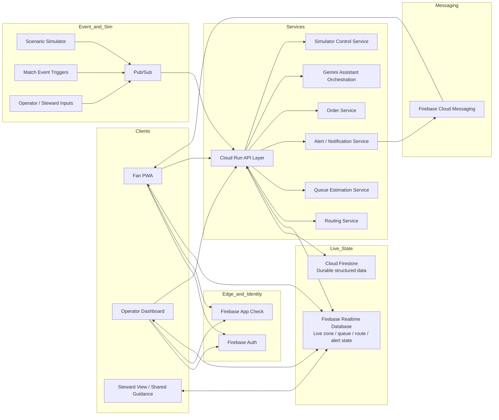
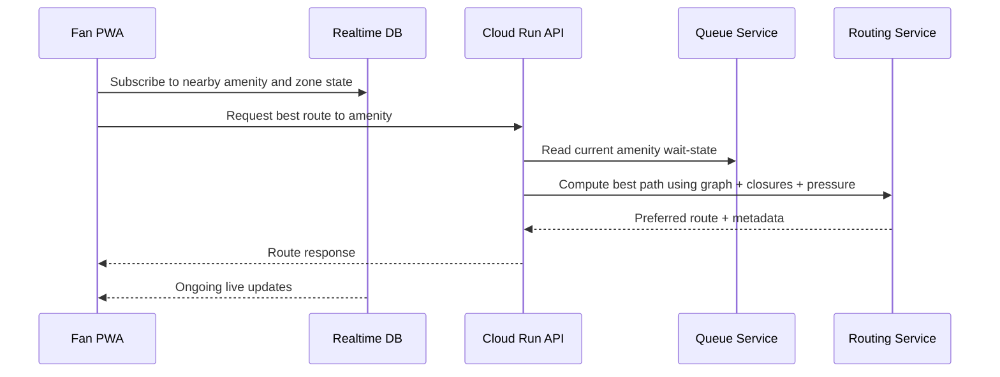
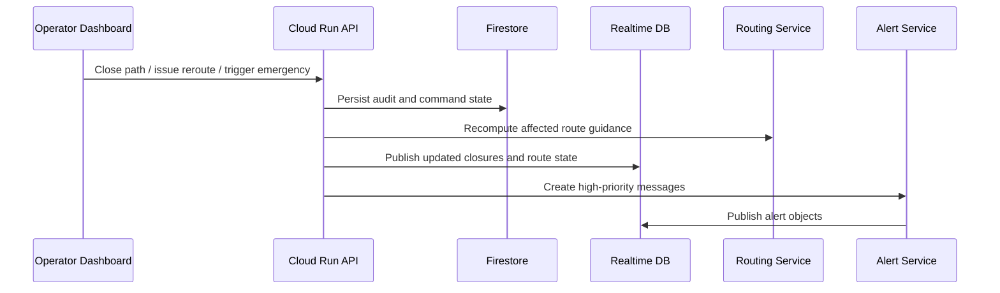
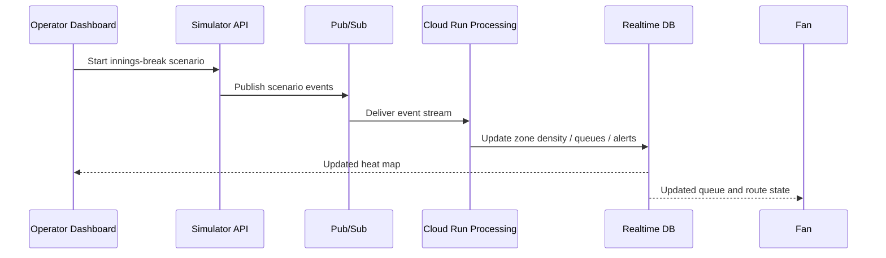
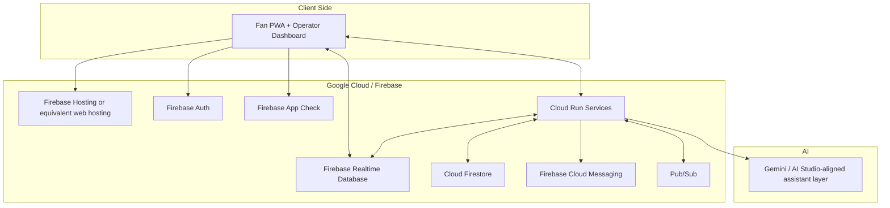

# MatchFlow Architecture Overview

## Document Metadata

| Field | Value |
|---|---|
| Document Title | MatchFlow Architecture Overview |
| Product | MatchFlow |
| Version | v1.0 |
| Status | Draft |
| Date | 2026-04-08 |
| Audience | Product owner, solution architect, developers, AI coding agents, challenge reviewers |
| Related Documents | BRD, PRD, Build Rules and SDD Working Method, future SRS, DESIGN.md, feature specs |

---

## 1. Purpose

This document defines the target architecture for **MatchFlow**, a cricket-aware smart stadium assistant and operator operations platform designed for a rapid 72-hour MVP build.

It provides a single architectural view of:

- system scope and boundaries
- logical components and responsibilities
- runtime data and event flow
- platform and deployment choices
- data/state ownership
- offline-first and realtime behavior
- security, testing, and observability guardrails
- the recommended implementation sequence under Spec-Driven Development (SDD)

This is intentionally an **architecture overview**, not a low-level implementation spec. Feature-level detail should be pushed into dedicated specs.

---

## 2. Architecture Goals

The MatchFlow architecture is designed to satisfy the following goals:

1. **Be believable within a 72-hour MVP build**  
   Favor a strong, end-to-end demonstration over deep enterprise complexity.

2. **Model cricket-specific crowd surges well**  
   Handle innings breaks, DRS spikes, wickets, and end-of-match exits as first-class operational scenarios.

3. **Support both fan and operator journeys**  
   One solution must serve fan utility and operator decision support together.

4. **Stay realtime without overbuilding**  
   Use zone-level state and platform-native live data distribution instead of raw custom infrastructure.

5. **Remain useful under weak connectivity**  
   Offline-first behavior is required for key flows.

6. **Keep safety credible**  
   Emergency closures, rerouting, and operator controls must be treated as protected, high-trust workflows.

7. **Be modular and spec-driven**  
   The architecture must support isolated feature slices, testable tasks, and incremental delivery.

---

## 3. Scope Framing

### 3.1 In scope for the MVP architecture

- Fan-facing mobile-first PWA
- Operator dashboard
- Zone-level venue and route graph model
- Zone heat map and amenity queue state
- Dynamic rerouting during surge conditions
- End-of-match exit guidance
- In-seat ordering workflow
- Emergency rerouting and closures
- Offline cache, stale-state handling, and action outbox
- Synthetic simulator for demo scenarios
- Google-native cloud services where practical
- Gemini-powered assistant/recommendation capability where useful

### 3.2 Explicitly out of scope

- Production CCTV/computer vision pipeline
- Full CAD/BIM integration
- Production indoor positioning
- Real sensor hardware dependency for the MVP
- Seat-level live tracking
- Full payment gateway integration
- Complex enterprise back-office workflows
- Heavy microservice sprawl

### 3.3 Key architecture constraint

The MVP must prove value through **zone-level operational intelligence**, not precision location tracking.

---

## 4. High-Level Solution View

MatchFlow is a **Google-native, event-informed, zone-based smart stadium system** with five major runtime areas:

1. **Fan Experience Layer**  
   Mobile-first PWA for queue visibility, routing, alerts, ordering, and emergency guidance.

2. **Operator Experience Layer**  
   Dashboard for heat maps, queue pressure, alerts, closures, reroutes, and simulator control.

3. **Realtime State Layer**  
   Centralized live crowd, zone, route, and amenity state distributed to clients.

4. **Service and Decision Layer**  
   Cloud Run services for routing, queue estimation, assistant orchestration, auth-aware actions, and simulator control.

5. **Simulation and Event Layer**  
   Synthetic event generation for surge windows and emergency scenarios, feeding the live-state model.

---

## 5. Architectural Principles

### 5.1 Zone-first modeling
Every important decision is made at the zone, path, amenity, or gate level. The system does not depend on seat-level live tracking.

### 5.2 Centralized derived state
Queue times, congestion bands, and route recommendations should be centrally computed and published as shared state, not recomputed independently in each client.

### 5.3 Lightweight realtime
Use managed platform services and compact payloads. Clients should subscribe to relevant state instead of aggressively polling.

### 5.4 Graceful degradation
When freshness drops or connectivity weakens, the product must fall back from exact values to coarse, still-usable guidance.

### 5.5 Protected operator authority
Closures, emergency mode, and operational overrides must be protected server-side.

### 5.6 Demo credibility over technical spectacle
A believable simulator and clean state transitions are more important than flashy but fragile integrations.

### 5.7 Build-by-spec
Every architectural slice should map cleanly to an implementation spec and a small task sequence.

---

## 6. Primary User Contexts

### 6.1 Fan context
Fans use MatchFlow to:

- find least-crowded concessions and washrooms
- receive route recommendations during innings breaks
- place in-seat snack orders
- get match-aware prompts about when to move
- receive emergency instructions and safe exits
- continue using key features under poor connectivity

### 6.2 Operator context
Operators use MatchFlow to:

- monitor zone congestion and amenity pressure
- identify hotspots early
- trigger queue/routing guidance
- close zones or paths
- activate emergency mode
- run simulator scenarios for demo and validation

### 6.3 Steward context
Stewards consume simplified rerouting and closure guidance.

---

## 7. Logical Architecture



---

## 8. Component Breakdown

## 8.1 Fan PWA

### Responsibility
The fan PWA is the mobile-first public stadium experience.

### Core capabilities
- match center / home
- nearby amenities with queue state
- route guidance to amenities and exits
- least-crowded recommendations
- in-seat ordering
- live alerts and match-aware notifications
- emergency guidance
- offline cache and action outbox

### Design constraints
- quick interpretation under pressure
- large touch targets
- non-color-only status indicators
- high contrast in bright stadium environments
- low cognitive load

### State approach
- subscribes to selected live state from Realtime Database
- stores essential context locally for offline access
- uses stale-while-revalidate behavior for queue and route state
- queues selected user actions in a local outbox when offline

---

## 8.2 Operator Dashboard

### Responsibility
The operator dashboard is the command-and-control interface for crowd flow monitoring and intervention.

### Core capabilities
- zone heat map
- amenity pressure overview
- hotspot summary
- reroute / alert actions
- path or zone closure actions
- emergency mode activation
- scenario simulator controls

### Design constraints
- fast scanning
- low-friction actions
- clear timestamps and confidence indicators
- stable during surge simulations

### State approach
- subscribes to live zone, amenity, and alert state
- sends protected commands through Cloud Run APIs
- never writes dangerous operational changes directly from the client to authoritative state without server validation

---

## 8.3 Venue Domain Model

### Responsibility
Provide the shared spatial and operational model of the stadium.

### Primary entities
- **Zone**: stand, concourse, gate area, corridor, food court, washroom cluster
- **Path**: directional or bidirectional connection between nodes
- **Gate**: entry or exit control point
- **Amenity**: concession or washroom node with queue state
- **Closure**: operator-driven disabled path or zone state
- **Event Trigger**: innings break, wicket, DRS, emergency, exit rush, manual operator signal

### Key rule
This is a **simplified graph-based digital twin**, not a CAD system.

### Why it matters
The domain model is the base for:
- route computation
- closure-aware rerouting
- heat map rendering
- queue association by zone/amenity
- simulator scenario effects

---

## 8.4 Routing Service

### Responsibility
Compute the best available route for a fan or evacuation target.

### Inputs
- source context: stand, zone, or current area
- target: amenity, gate, or exit
- graph topology from the venue model
- active closures
- zone pressure weights
- route policy: convenience vs emergency

### Outputs
- preferred route
- ETA band or estimate
- alternative route if available
- route status and freshness
- reason metadata for explainability

### Architectural note
For the MVP, route selection should prefer simple, explainable heuristics over overly advanced optimization.

---

## 8.5 Queue Estimation Service

### Responsibility
Produce shared amenity wait-state objects for use by fan and operator surfaces.

### Inputs
- amenity activity events
- surge scenario state
- zone density pressure
- operator overrides where needed

### Outputs per amenity
- estimated wait time
- wait band (low / moderate / high)
- queue length estimate
- confidence
- updated timestamp
- expiry timestamp

### Architectural rule
Queue state is **centrally computed and cached**, then published for client subscription.

---

## 8.6 Live State Publisher

### Responsibility
Own the fan-safe and ops-relevant live state objects that must update quickly.

### Candidate live-state objects
- `zones/{zoneId}`
- `amenities/{amenityId}`
- `routes/{routeContextId}`
- `alerts/{alertId}`
- `scenarios/current`
- `ops/summary`

### Why Realtime Database fits the MVP
- fast fan/ops subscription model
- simple live-demo state distribution
- easy alignment with compact object updates

---

## 8.7 Cloud Firestore

### Responsibility
Store durable structured records that should not be modeled only as live transient state.

### Candidate durable collections
- venue model metadata
- match/session metadata
- menu and order catalog
- order records
- audit trail of operator interventions
- user profile or seat context where needed
- simulator scenario definitions
- configuration and thresholds

### Rule of thumb
- **Realtime Database** for fast-changing shared live state
- **Firestore** for durable structured records and configuration

---

## 8.8 Order Service

### Responsibility
Support a lightweight but believable in-seat ordering flow.

### Scope for MVP
- browse limited menu
- add to cart
- select service mode
- place order
- track simple order states
- tolerate offline intent capture and retry

### Important limit
Payment may be mocked or simulated. The architecture should not depend on a production payment gateway for the MVP.

---

## 8.9 Alert and Notification Service

### Responsibility
Create actionable messages for fans and operators.

### Trigger categories
- innings break surge
- DRS spike
- wicket surge
- end-of-match flow
- high queue pressure
- route closure
- emergency mode

### Delivery paths
- in-app live alerts via Realtime Database
- optional push delivery via FCM

### Message principle
Notifications should be short, actionable, and prioritized. Emergency messaging overrides convenience messaging.

---

## 8.10 Simulator and Event Pipeline

### Responsibility
Generate believable live-state changes without requiring real venue hardware.

### Required scenarios
- innings break rush
- DRS spike
- wicket-related surge
- end-of-match exit rush
- emergency closure scenario

### Event sources for the MVP
- synthetic crowd movement events
- synthetic amenity demand events
- operator actions
- steward inputs
- match moment triggers

### Suggested flow
1. simulator scenario starts
2. scenario emits events through Pub/Sub
3. Cloud Run services update queue and zone state
4. live state is republished to clients
5. alerts and route recalculations propagate

---

## 8.11 Gemini Assistant / Recommendation Layer

### Responsibility
Provide assistant-like intelligence without becoming a separate uncontrolled subsystem.

### Example roles
- explain why an amenity is recommended
- suggest best time to move during a match moment
- provide fan-facing utility guidance
- provide operator-facing summary insight

### Guardrail
Gemini should sit **on top of authoritative system state**, not replace routing, safety, or operational logic.

---

## 9. Runtime Data Flow

## 9.1 Standard fan utility flow



## 9.2 Operator intervention flow



## 9.3 Simulator scenario flow



---

## 10. State Ownership Model

## 10.1 Authoritative live state
The backend owns authoritative live operational state.

Examples:
- zone congestion band
- amenity queue band and estimate
- active closures
- emergency mode
- active alerts
- scenario status

## 10.2 Durable state
Firestore owns records that must survive beyond transient live view updates.

Examples:
- venue layout metadata
- menu items
- order records
- operator action log
- configuration

## 10.3 Local client state
Clients may cache only what is required for usability and resilience.

Examples:
- last known fan context
- last known route guidance
- last known nearby amenity state
- order cart
- pending offline actions

## 10.4 State design rule
The client should never become the source of truth for dangerous operational state.

---

## 11. Realtime Strategy

### 11.1 Why realtime is needed
MatchFlow’s value depends on surfacing meaningful change during surge moments.

### 11.2 Realtime design decisions
- publish compact zone-level and amenity-level updates
- increase update cadence during surge windows
- reduce update cadence during calm periods
- avoid client-side polling for wait-time estimation
- separate fan-safe views from richer operator state where needed

### 11.3 Live data characteristics
Each live-state object should carry freshness metadata such as:
- updated time
- expiry time or staleness threshold
- confidence or quality indicator where applicable

---

## 12. Offline-First Architecture

### 12.1 Required offline-capable flows
- app shell startup
- map basics
- seat/stand context
- saved routes
- last known queue and amenity guidance
- order cart and pending order intent
- emergency guidance snapshot

### 12.2 Recommended client behavior
- cache essential views and small datasets locally
- keep a pending action outbox
- retry sync when connectivity returns
- display freshness labels clearly
- degrade from exact values to coarse bands when data stales

### 12.3 Safety-specific rule
In degraded mode, safety messaging takes priority over convenience features.

---

## 13. Security Architecture

### 13.1 Identity and access
- fans access public or low-risk app features
- operator actions require authentication
- role-aware access should distinguish fan vs operator capabilities
- operator-only commands must be validated server-side

### 13.2 Sensitive actions
The following require protected server-side enforcement:
- activate emergency mode
- close zone or path
- issue operator-level reroute
- publish high-priority operational alerts

### 13.3 Client protection
Use Firebase App Check for client protection where practical in the MVP.

### 13.4 Secret handling
- no secrets in client bundles
- environment configuration separated by environment
- service credentials managed outside source code

### 13.5 Privacy stance
The architecture intentionally avoids precise individual tracking for the MVP.

---

## 14. Performance and Efficiency

### 14.1 Core performance stance
The system should remain responsive under simulated surge conditions without depending on high-volume payloads.

### 14.2 Efficiency rules
- zone-level updates over fine-grained tracking
- compact live-state objects
- centralized queue estimation
- route computation triggered by meaningful events, not noise
- lazy-load non-essential UI where useful

### 14.3 MVP target behavior
The app should remain demo-stable when simulator scenarios intensify during innings break and exit rush sequences.

---

## 15. Accessibility and UX Guardrails

### Fan-facing guardrails
- high contrast
- large tap targets
- readable status at a glance
- non-color-only communication
- usable one-handed under time pressure
- clear offline and stale-state messaging

### Operator-facing guardrails
- hotspot summary visible immediately
- action hierarchy is obvious
- timestamps and confidence visible
- emergency state unmistakable

### Architecture implication
Accessibility is not just visual design; it also affects:
- payload simplicity
- decision latency
- copy length
- fallback design in degraded mode

---

## 16. Observability and Auditability

Even for an MVP, the architecture should leave space for basic observability.

### Recommended minimum signals
- simulator scenario started/stopped
- route recomputation events
- queue estimation refresh events
- emergency mode toggles
- operator intervention logs
- order state changes
- client sync failures and retry counts where practical

### Audit requirements
At minimum, persist audit entries for:
- path/zone closures
- emergency mode changes
- operator-issued alerts
- manual overrides

---

## 17. Deployment View



### Recommended deployment interpretation
- host the web app as a PWA
- run backend APIs and workers on Cloud Run
- use Pub/Sub for simulator/event fan-out
- use Realtime Database for live operational state
- use Firestore for durable records
- use FCM for push where valuable

---

## 18. Repo and Code Organization Guidance

The repo should make the architecture obvious.

### Suggested top-level shape

```text
/docs
  /architecture
    architecture-overview.md
  /product
  /design
  /runbooks
  /testing

/ai
  /specs
  /templates

/apps
  /fan-pwa
  /ops-dashboard

/services
  /api
  /routing
  /queue
  /simulator
  /alerts
  /orders
  /assistant

/packages
  /domain
  /shared-types
  /ui
  /utils

/tests
  /unit
  /integration
  /scenarios
```

### Organization principles
- keep shared domain types centralized
- isolate routing and queue logic from UI
- isolate simulator/event processing from presentation code
- keep Firebase access inside service boundaries or adapters
- preserve clear separation between business docs, specs, design docs, and code

---

## 19. Testing Architecture

### Must-test domains
- venue graph and route computation
- queue estimation and wait-band logic
- zone congestion state transitions
- emergency closures and reroute propagation
- offline cache and outbox behavior
- order flow state transitions
- simulator-to-live-state propagation

### Recommended test layers
- **unit tests** for domain and business rules
- **integration tests** for service flows and state publishing
- **scenario tests** for innings break, DRS, exit rush, and emergency mode
- **manual demo checks** for core fan and operator flows

### Architectural rule
The simulator is not only for demo. It is also the main scenario-validation engine for the MVP.

---

## 20. Build Method Alignment

This architecture is intended to be executed through **Spec-Driven Development**.

### Recommended initial spec sequence
1. `01-venue-domain-model`
2. `02-fan-app-shell`
3. `03-live-heatmap`
4. `04-queue-alerts`
5. `05-in-seat-ordering`
6. `06-emergency-reroute`
7. `07-offline-sync`
8. `08-demo-simulator`

### Working pattern
**one spec → one task → one verification → one review → one commit**

### Architectural benefit of this approach
It reduces scope creep, keeps the app runnable, and allows the architecture to emerge in stable, testable slices.

---

## 21. Key Architecture Decisions Confirmed

1. **MatchFlow is zone-based, not seat-tracking-based.**
2. **Realtime state is centrally computed and distributed.**
3. **Realtime Database is preferred for live state; Firestore for durable records.**
4. **Cloud Run is the primary backend execution layer.**
5. **Simulator-driven eventing is a first-class architectural component.**
6. **Emergency routing is built on the same graph model as normal routing, with different policy rules.**
7. **Offline-first behavior is mandatory for critical fan flows.**
8. **Operator authority is protected server-side.**
9. **Gemini is assistive, not authoritative.**
10. **The architecture must stay small, believable, modular, and demo-ready.**

---

## 22. Deferred or Future Enhancements

These are intentionally outside the current architectural commitment, but the current design leaves room for them later:

- real sensor ingestion
- CCTV/computer vision adapters
- richer historical analytics and replay
- BigQuery event analytics
- advanced demand forecasting for concessions
- deeper order fulfillment workflows
- richer staff/steward operational tooling
- venue-to-venue configuration templates
- premium fan personalization

---

## 23. Open Decisions to Resolve During Build

These do not block the architecture overview, but they should be finalized in feature specs:

1. Exact venue graph schema and file format
2. Operator role model depth for the MVP
3. Whether fan and ops UI live in one app shell or separate deployable apps
4. Final order-service flow: pickup only vs pickup + in-seat delivery simulation
5. Exact alert prioritization policy
6. Whether FCM push is implemented or only modeled in-app for the MVP
7. How much Gemini functionality is included in the final demo slice
8. Whether BigQuery is omitted entirely for the first MVP cut

---

## 24. Recommended Next Artifacts

After this document, the next architecture-aligned artifacts should be:

1. `/ai/specs/01-venue-domain-model.md`
2. `/ai/specs/02-fan-app-shell.md`
3. `/ai/specs/03-live-heatmap.md`
4. `/ai/specs/04-queue-alerts.md`
5. `/ai/specs/05-in-seat-ordering.md`
6. `/ai/specs/06-emergency-reroute.md`
7. `/ai/specs/07-offline-sync.md`
8. `/ai/specs/08-demo-simulator.md`
9. `docs/design/DESIGN.md`
10. `docs/runbooks/local-development.md`
11. `docs/testing/demo-scenario-checklist.md`

---

## 25. Summary

MatchFlow’s architecture is intentionally pragmatic.

It combines:
- a **fan PWA** for utility and guidance
- an **operator dashboard** for crowd-flow control
- a **zone-based digital twin** for routing and closures
- a **central live-state model** for heat maps and queue alerts
- a **Cloud Run service layer** for routing, orders, alerts, simulation, and assistant logic
- **Firebase services** for realtime delivery, durable storage, identity, and messaging
- a **simulator-first event pipeline** to prove value without hardware dependency
- an **offline-first client model** to remain useful inside congested stadium networks

This gives MatchFlow a strong architectural foundation for a challenge-ready smart stadium MVP that is modular, credible, testable, and aligned with the project’s business and product goals.
