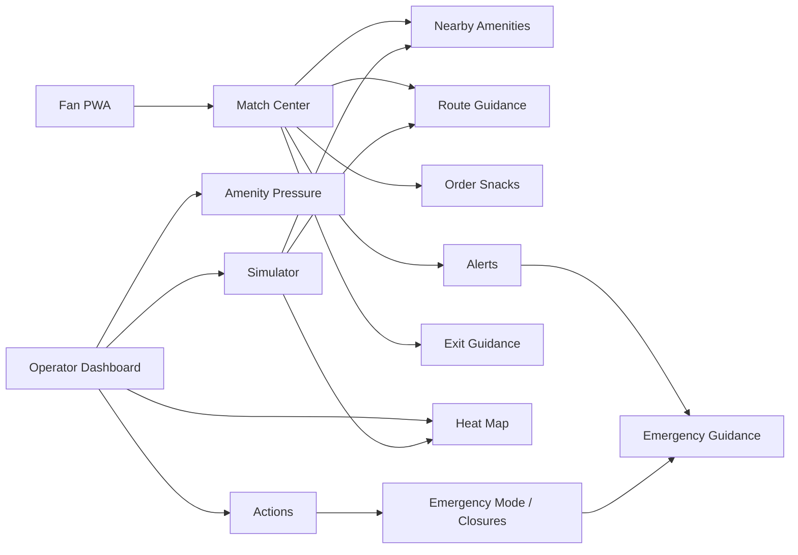
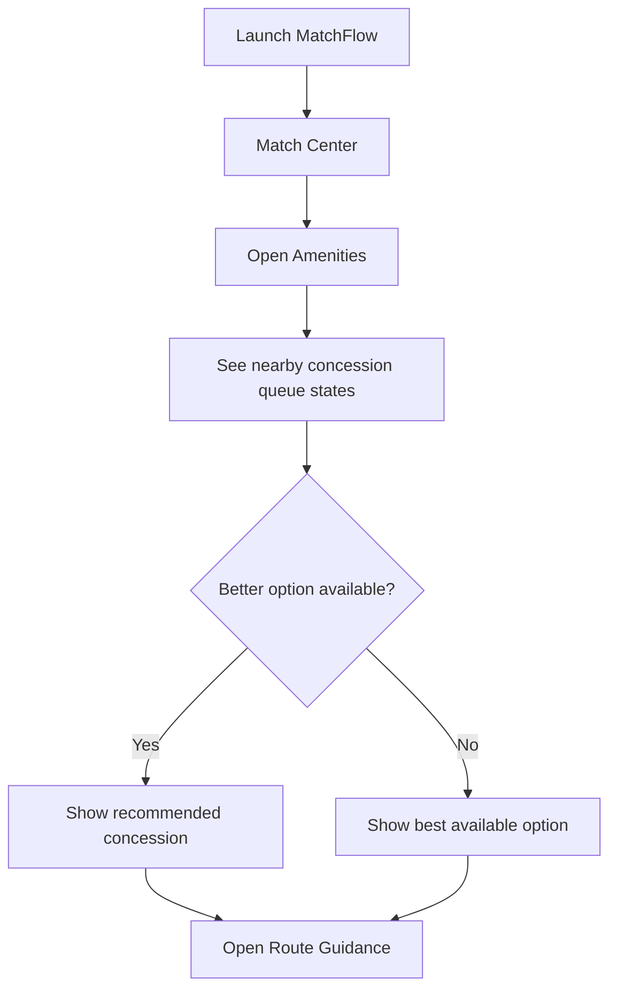
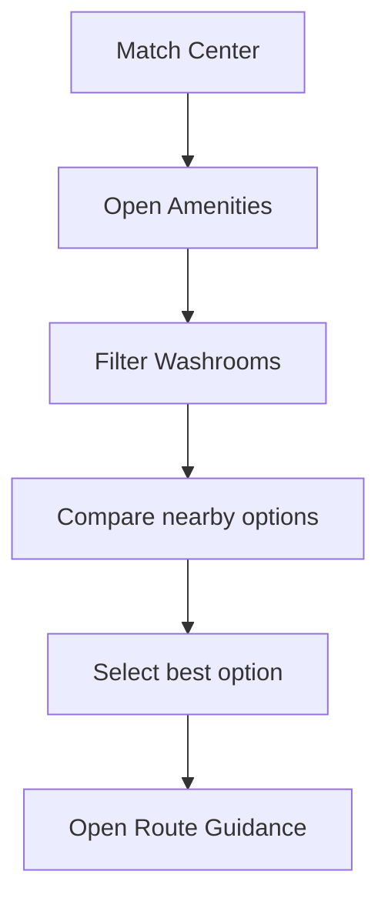
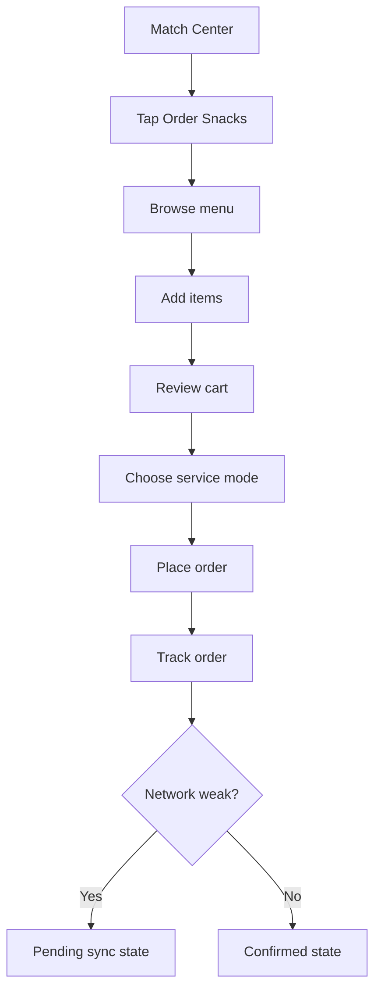
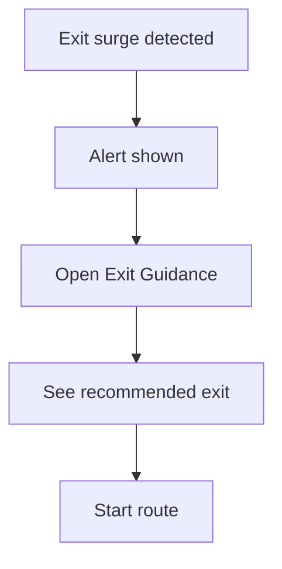
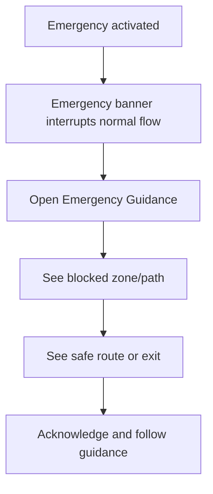
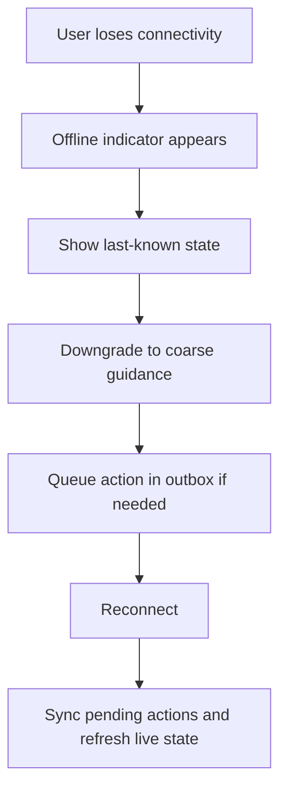
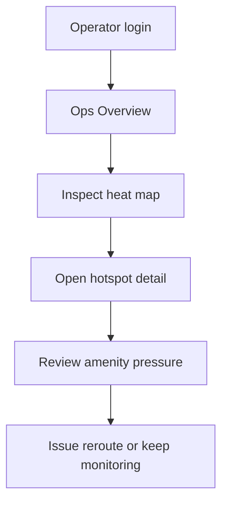
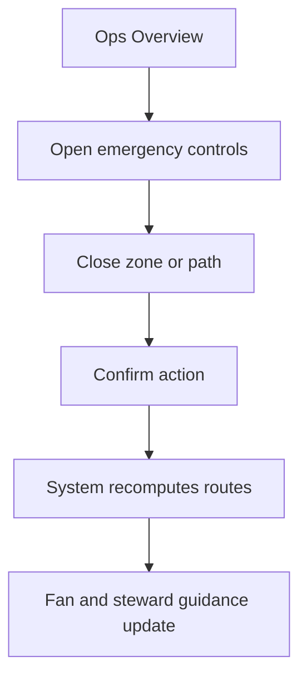
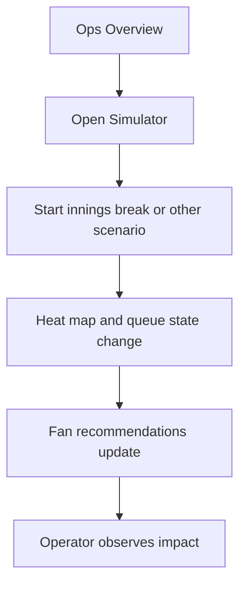

# MatchFlow Screen Flows

## Document Metadata

| Field | Value |
|---|---|
| Document Title | MatchFlow Screen Flows |
| Product | MatchFlow |
| Version | v1.0 |
| Status | Draft |
| Date | 2026-04-08 |
| Audience | Product owner, architect, frontend developers, design agents, AI coding agents |
| Related Documents | `docs/product/BRD.md`, `docs/product/PRD.md`, `docs/architecture/architecture-overview.md`, `docs/design/DESIGN.md`, feature specs |
| Positioning | Challenge-scoped MVP |

---

## 1. Purpose

This document defines the **screen-level flow model** for MatchFlow across the fan, operator, and supporting stewardship experiences.

It is intended to act as a practical bridge between:
- product requirements,
- architecture decisions,
- Stitch-generated screens,
- future `DESIGN.md`,
- and implementation specs.

This document focuses on:
- what screens exist,
- how users move between them,
- what each screen must help the user do,
- which states matter for demo credibility,
- and which flows are essential for the MVP.

MatchFlow is a **challenge-scoped MVP**, not a full production rollout. The goal is a believable, demo-ready product slice for large cricket venues built around queue-aware guidance, routing, in-seat ordering, live operations visibility, and safety-first rerouting. :contentReference[oaicite:1]{index=1} :contentReference[oaicite:2]{index=2}

---

## 2. Design Intent

The screen model must reflect the core MatchFlow operating idea:

- fans should understand the **best next action** quickly,
- operators should identify and act on **hotspots** quickly,
- emergency states must override convenience states,
- the system must remain useful under weak connectivity,
- and the product should feel purpose-built for **cricket surge moments** such as innings break, DRS spikes, wickets, and end-of-match exits. :contentReference[oaicite:3]{index=3} :contentReference[oaicite:4]{index=4}

---

## 3. Product Surfaces Covered

MatchFlow currently has three practical surfaces in the screen model:

1. **Fan PWA**
2. **Operator Dashboard**
3. **Steward / Shared Guidance View**

These sit on top of a zone-based venue model and live state architecture, with routing, queue estimation, alerts, simulator control, and emergency actions handled centrally. :contentReference[oaicite:5]{index=5} :contentReference[oaicite:6]{index=6}

---

## 4. Screen Flow Principles

### 4.1 Fan-side principles
- mobile-first
- low cognitive load
- large tap targets
- non-color-only status indicators
- fast understanding while walking, waiting, or under glare
- live state with freshness cues
- graceful offline degradation

### 4.2 Operator-side principles
- fast scanning
- visible priority zones
- clear timestamps and confidence
- low-friction actions
- protected control flows
- stable behavior during simulator-driven surges

### 4.3 Flow discipline
- one strong fan flow
- one strong operator flow
- one strong simulator-backed demo flow
- one clear emergency override flow

These priorities are aligned with MatchFlow’s demo-readiness and spec-driven build method. :contentReference[oaicite:7]{index=7} :contentReference[oaicite:8]{index=8}

---

## 5. High-Level Experience Map

----------

## 6. Recommended Fan Information Architecture

The fan PWA should feel like one compact stadium companion rather than many separate tools. A recommended MVP navigation structure is:

-   **Match Center**
    
-   **Amenities**
    
-   **Route**
    
-   **Order**
    
-   **Alerts**
    

Exit guidance and emergency guidance may be surfaced contextually rather than as always-visible primary tabs.

### Recommended fan entry logic

-   app launch should land in **Match Center**
    
-   if there is an active emergency, land in **Emergency Guidance**
    
-   if a fan taps a notification, deep-link into the relevant target state:
    
    -   amenity recommendation,
        
    -   route,
        
    -   order tracking,
        
    -   exit guidance,
        
    -   emergency guidance
        

This keeps the fan experience aligned to the PRD requirement that the app open into a match-aware home and preserve essential context for offline use.

----------

## 7. Fan Screen Inventory

## F-01 Match Center / Home

**Purpose**  
Primary landing screen for fan decisions during live match attendance.

**Must show**

-   live match context
    
-   seat/stand context
    
-   quick actions:
    
    -   nearby amenities
        
    -   find route
        
    -   order snacks
        
    -   alerts
        
-   smart prompt / recommended next action
    
-   top nearby queue snapshot
    
-   freshness indicator
    

**Primary actions**

-   open amenities
    
-   start route
    
-   open order flow
    
-   view alerts
    
-   view exit guidance when relevant
    

**Key states**

-   normal play
    
-   innings break surge
    
-   wicket/DRS contextual prompt
    
-   exit rush prompt
    
-   stale data
    
-   offline degraded mode
    
-   emergency takeover banner
    

----------

## F-02 Nearby Amenities

**Purpose**  
Help the fan compare nearby washrooms and concessions quickly.

**Must show**

-   amenity list grouped by type
    
-   wait state or wait band
    
-   updated time / freshness
    
-   distance or walk-time hint
    
-   best nearby recommendation
    
-   alternate options if recommendation changes
    

**Primary actions**

-   open amenity details
    
-   compare nearby options
    
-   start route to selected amenity
    
-   pivot to in-seat ordering when concession pressure is high
    

**Key states**

-   low / moderate / high queue
    
-   recommendation available
    
-   no clearly better option
    
-   stale data downgraded to coarse band
    
-   offline last-known state
    

----------

## F-03 Amenity Detail / Recommendation Detail

**Purpose**  
Explain why a specific amenity is being suggested.

**Must show**

-   selected amenity name and type
    
-   current queue condition
    
-   ETA from current context
    
-   reason for recommendation
    
-   alternate nearby option if relevant
    
-   freshness and confidence metadata
    

**Primary actions**

-   start route
    
-   save route
    
-   switch to alternate option
    
-   switch to order flow for concession cases
    

----------

## F-04 Route Guidance

**Purpose**  
Guide the fan to an amenity or exit using the simplified venue graph.

**Must show**

-   destination
    
-   route status
    
-   ETA
    
-   crowd pressure on current route
    
-   alternative route availability
    
-   closure awareness
    
-   “updated X sec ago”
    
-   safe wording when route is best available but not ideal
    

**Primary actions**

-   start walking
    
-   recalculate
    
-   switch destination
    
-   return to match center
    

**Key states**

-   preferred route
    
-   alternate route available
    
-   no alternate route
    
-   congestion rising
    
-   route stale
    
-   route closed -> recompute
    
-   emergency override
    

----------

## F-05 Order Snacks / Menu

**Purpose**  
Offer a queue-reduction alternative to joining a crowded concession line.

**Must show**

-   limited MVP menu
    
-   item categories
    
-   item availability
    
-   service mode hint
    
-   queue-aware nudge where relevant
    

**Primary actions**

-   add item to cart
    
-   change quantity
    
-   view cart
    
-   return to match center
    

**Key states**

-   normal service
    
-   pickup recommended
    
-   in-seat delivery simulated
    
-   item unavailable
    

----------

## F-06 Cart and Service Mode

**Purpose**  
Complete a lightweight order flow.

**Must show**

-   selected items
    
-   service mode
    
-   order summary
    
-   order placement action
    
-   network/pending sync indication if needed
    

**Primary actions**

-   place order
    
-   edit cart
    
-   change service mode
    
-   cancel
    

**Key states**

-   online confirmation
    
-   offline queued action
    
-   retry needed
    
-   simulated payment note if shown
    

----------

## F-07 Order Tracking

**Purpose**  
Show simple order states after placement.

**Must show**

-   order number/reference
    
-   service mode
    
-   order state
    
-   next expected action
    
-   reconnect / retry state if sync was delayed
    

**Recommended simple states**

-   pending sync
    
-   confirmed
    
-   preparing
    
-   ready for pickup / on the way
    
-   completed
    
-   failed / needs retry
    

----------

## F-08 Alerts Center

**Purpose**  
Collect match-aware and operational alerts in one place.

**Must show**

-   alert list
    
-   priority labels
    
-   time received
    
-   action CTA where relevant
    

**Alert categories**

-   queue recommendation
    
-   innings break move now / move later prompt
    
-   DRS or wicket context prompt
    
-   end-of-match exit guidance
    
-   closure alert
    
-   emergency alert
    

**Behavior rule**  
Emergency alerts override convenience alerts.

----------

## F-09 Exit Guidance

**Purpose**  
Provide guided dispersal after the match or when exit pressure rises.

**Must show**

-   recommended exit
    
-   route status
    
-   crowd condition
    
-   alternate gate when useful
    
-   safe movement wording
    
-   emergency escalation if applicable
    

**Primary actions**

-   start exit route
    
-   view alternate
    
-   return to alerts or match center
    

----------

## F-10 Emergency Guidance

**Purpose**  
Provide the highest-priority fan screen when safety-related rerouting is active.

**Must show**

-   emergency banner
    
-   blocked zone/path message
    
-   safe route or exit
    
-   step-by-step instruction
    
-   acknowledgment action
    
-   optional re-open instructions
    

**Behavior**

-   should pre-empt normal convenience flows
    
-   must stay readable in degraded connectivity
    
-   must remain clear without relying only on color
    

----------

## F-11 Offline / Degraded State Overlay

**Purpose**  
Communicate degraded connectivity without making the app unusable.

**Must show**

-   offline or weak network indicator
    
-   last updated timestamp
    
-   downgrade from exact minutes to queue bands
    
-   queued action message if applicable
    
-   retry behavior cue
    

**Applies to**

-   Match Center
    
-   Amenities
    
-   Route Guidance
    
-   Order flow
    
-   Exit Guidance
    
-   Emergency Guidance
    

This aligns with MatchFlow’s offline-first approach, last-known useful state, outbox behavior, and freshness messaging.

----------

## 8. Recommended Operator Information Architecture

The operator dashboard should optimize for fast scanning, controlled actions, and visible impact. A recommended MVP structure is:

-   **Overview**
    
-   **Zones**
    
-   **Amenities**
    
-   **Alerts / Actions**
    
-   **Simulator**
    
-   **Emergency Controls**
    

Where helpful, Overview can include the other sections as panels rather than deep separate pages.

### Recommended operator entry logic

-   authenticated entry required
    
-   default landing on **Overview**
    
-   if emergency mode is active, emergency state should be visible immediately
    
-   simulator status should be visible globally when a scenario is running
    

Protected actions must remain operator-only and server-validated.

----------

## 9. Operator Screen Inventory

## O-01 Operator Login / Protected Entry

**Purpose**  
Ensure sensitive actions are not exposed to fan users.

**Must show**

-   operator sign-in
    
-   environment/role context if needed
    
-   safe error messaging
    

**Primary actions**

-   sign in
    
-   continue to dashboard
    

----------

## O-02 Ops Overview / Heat Map Dashboard

**Purpose**  
Primary command center screen for crowd monitoring.

**Must show**

-   zone heat map
    
-   top hotspots
    
-   amenity pressure summary
    
-   alert summary
    
-   simulator state
    
-   emergency state banner if active
    
-   quick actions
    

**Primary actions**

-   open zone detail
    
-   open amenity pressure detail
    
-   issue reroute
    
-   send alert
    
-   open simulator controls
    
-   activate emergency mode
    

**Key states**

-   normal play
    
-   innings break surge
    
-   DRS spike
    
-   wicket surge
    
-   end-match exit rush
    
-   emergency active
    

----------

## O-03 Zone Detail

**Purpose**  
Help the operator inspect one hotspot or affected area.

**Must show**

-   zone name and type
    
-   congestion band
    
-   density trend or direction
    
-   nearby amenities
    
-   affected paths
    
-   linked alert/recommendation context
    
-   closure state
    

**Primary actions**

-   issue guidance
    
-   mark for monitoring
    
-   open closure action
    
-   return to overview
    

----------

## O-04 Amenity Pressure Detail

**Purpose**  
Help the operator inspect queue pressure across concessions and washrooms.

**Must show**

-   amenity list or map-linked panel
    
-   wait condition
    
-   confidence
    
-   updated time
    
-   nearby alternatives
    
-   whether redirection may help
    

**Primary actions**

-   issue fan-facing guidance
    
-   highlight a recommended alternative
    
-   monitor queue normalization
    

----------

## O-05 Guidance / Alert Action Panel

**Purpose**  
Allow operators to issue controlled reroutes or informational alerts.

**Must show**

-   target audience or zone context
    
-   message type
    
-   prebuilt message templates
    
-   priority level
    
-   preview before publish
    

**Primary actions**

-   issue reroute guidance
    
-   send operational alert
    
-   cancel
    

**Guardrail**

-   emergency messages should use a separate higher-trust flow
    

----------

## O-06 Closure and Emergency Control

**Purpose**  
Manage the most sensitive operational state changes.

**Must show**

-   emergency mode status
    
-   zone/path closure controls
    
-   affected routes preview
    
-   confirmation step
    
-   audit note field if included
    

**Primary actions**

-   close path
    
-   close zone
    
-   activate emergency mode
    
-   clear emergency mode
    
-   confirm action
    

**Guardrail**

-   dangerous actions must not look like lightweight casual toggles
    

----------

## O-07 Simulator Control

**Purpose**  
Drive believable demo conditions and scenario validation.

**Must show**

-   scenario choices:
    
    -   innings break rush
        
    -   DRS spike
        
    -   wicket surge
        
    -   end-match exit rush
        
    -   emergency closure
        
-   scenario status
    
-   start/stop/reset controls
    
-   visible confirmation of impact
    

**Primary actions**

-   start scenario
    
-   switch scenario
    
-   stop scenario
    
-   reset demo state
    

**Behavior**

-   should visibly affect heat map, queue pressure, alerts, and recommended routes
    

----------

## O-08 Incident / Audit View

**Purpose**  
Show what the operator changed and when.

**Must show**

-   emergency toggles
    
-   path/zone closures
    
-   operator-issued alerts
    
-   manual overrides
    
-   timestamps
    

**Priority**

-   recommended for credibility
    
-   may be lightweight in MVP form
    

----------

## 10. Steward / Shared Guidance Screen Inventory

## S-01 Steward Guidance View

**Purpose**  
Provide simplified reroute and closure instructions for on-ground staff.

**Must show**

-   affected zone/path
    
-   current instruction
    
-   redirected route or gate
    
-   emergency note if active
    
-   timestamp
    

**Primary actions**

-   refresh
    
-   acknowledge
    
-   return to current instruction
    

This is a secondary surface, but it strengthens the operational story because stewards are explicitly part of the supported user context.

----------

## 11. Core Fan Journeys

## 11.1 Find the Least-Crowded Concession

**Primary screens**

-   F-01
    
-   F-02
    
-   F-03
    
-   F-04
    

**Why it matters**  
This is one of the strongest “wow” flows and directly reflects MatchFlow’s utility promise.

----------

## 11.2 Find the Least-Crowded Washroom

**Primary screens**

-   F-01
    
-   F-02
    
-   F-03
    
-   F-04
    

----------

## 11.3 In-Seat Ordering Alternative

**Primary screens**

-   F-01
    
-   F-05
    
-   F-06
    
-   F-07
    
-   F-11
    

----------

## 11.4 End-of-Match Exit Guidance

**Primary screens**

-   F-08
    
-   F-09
    
-   F-04
    

----------

## 11.5 Emergency Reroute

**Primary screens**

-   F-10
    
-   F-04
    
-   F-11
    

----------

## 11.6 Offline Recovery Flow

**Primary screens**

-   F-11
    
-   F-01
    
-   F-04
    
-   F-06
    
-   F-07
    

----------

## 12. Core Operator Journeys

## 12.1 Monitor Surge Conditions

**Primary screens**

-   O-01
    
-   O-02
    
-   O-03
    
-   O-04
    
-   O-05
    

----------

## 12.2 Trigger Emergency Closure

**Primary screens**

-   O-02
    
-   O-06
    
-   S-01
    
-   F-10
    

----------

## 12.3 Run Demo Scenario

**Primary screens**

-   O-02
    
-   O-07
    
-   F-01
    
-   F-02
    
-   F-04
    

----------

## 13. Cross-Cutting Screen States

These states are not separate products by themselves, but they must be represented consistently across screens.

### 13.1 Loading

-   visible but lightweight
    
-   never leave the user without context
    
-   prefer skeletons or placeholder cards over blank screens
    

### 13.2 Empty / No Alert

-   show useful fallback copy
    
-   suggest next likely action
    

### 13.3 Stale Live Data

-   show “updated X sec/min ago”
    
-   degrade to queue bands
    
-   avoid pretending stale data is fresh
    

### 13.4 Offline

-   keep last-known useful state visible
    
-   show queued actions clearly
    
-   prioritize safety messaging
    

### 13.5 No Better Alternative

-   do not fail silently
    
-   show best available option with clear status
    

### 13.6 Emergency Override

-   visually unmistakable
    
-   supersedes convenience prompts
    
-   routes and alerts should align
    

### 13.7 Operator Auth Required

-   protected controls hidden or blocked for non-operator users
    

### 13.8 Scenario Active

-   simulator status visible on operator screens
    
-   relevant fan screens should visibly react to changed conditions
    

----------

## 14. Recommended Screen Priority for MVP Build

### P0 fan screens

-   F-01 Match Center
    
-   F-02 Nearby Amenities
    
-   F-04 Route Guidance
    
-   F-08 Alerts Center
    
-   F-09 Exit Guidance
    
-   F-10 Emergency Guidance
    
-   F-11 Offline / Degraded State
    

### P0 operator screens

-   O-01 Operator Login
    
-   O-02 Ops Overview / Heat Map Dashboard
    
-   O-04 Amenity Pressure Detail
    
-   O-06 Closure and Emergency Control
    
-   O-07 Simulator Control
    

### P1 screens

-   F-05 Order Snacks / Menu
    
-   F-06 Cart and Service Mode
    
-   F-07 Order Tracking
    
-   O-03 Zone Detail
    
-   O-05 Guidance / Alert Action Panel
    

### P2 / stretch

-   O-08 Incident / Audit View
    
-   S-01 Steward Guidance View
    

This prioritization keeps the build aligned with the PRD’s P0 product outcomes and the architecture’s recommended sequence.

----------

## 15. Screen-to-Feature Mapping

Feature

Primary Screens

Fan app shell

F-01, F-02, F-04, F-08

Queue alerts

F-02, F-03, O-04

Dynamic rerouting

F-04, F-09, O-02, O-05

In-seat ordering

F-05, F-06, F-07

Emergency rerouting

F-10, O-06, S-01

Offline-first behavior

F-11 plus overlays on F-01/F-04/F-06

Live heat map

O-02, O-03

Demo simulator

O-07 with visible downstream effect on fan and ops screens

----------

## 16. Scenario-to-Screen Mapping

Scenario

Fan Screens Impacted

Operator Screens Impacted

Innings break rush

F-01, F-02, F-04, F-08

O-02, O-04, O-07

DRS spike

F-01, F-08

O-02, O-07

Wicket surge

F-01, F-08

O-02, O-07

End-match exit rush

F-08, F-09, F-04

O-02, O-07

Emergency closure

F-10, F-04, F-11

O-02, O-06, O-07, S-01

Weak connectivity

F-11 plus affected functional screen

O-02 should still show clear state/freshness

----------

## 17. Accessibility Notes for All Screens

Every screen in this document should follow these minimum rules:

-   readable in bright environments,
    
-   high contrast,
    
-   large tap or click targets,
    
-   non-color-only status indicators,
    
-   clear offline, alert, and emergency states,
    
-   concise copy with strong action hierarchy.
    

This is especially important because MatchFlow is meant for stadium use under glare, crowd pressure, distraction, and weak connectivity.

----------

## 18. Implementation Notes for Stitch and Antigravity

### For Stitch

-   use this file to keep screen set and navigation consistent
    
-   treat this as a flow source of truth alongside `DESIGN.md`
    
-   do not invent new product areas outside the listed MVP screens unless explicitly requested
    

### For Antigravity or other coding agents

-   implement one screen slice or one flow slice at a time
    
-   keep fan and operator flows bounded
    
-   do not mix unrelated feature work in the same task
    
-   preserve the mapping between screens, live state, and simulator-driven behavior
    

This follows MatchFlow’s screen-flow-notes requirement and SDD operating model.

----------

## 19. Open Design Decisions

These do not block this document, but should be finalized in `DESIGN.md` or feature specs:

1.  whether fan and ops live in one app shell or separate deployable apps
    
2.  exact tab labels and bottom-nav structure for the fan PWA
    
3.  whether order flow supports pickup only or pickup plus simulated in-seat delivery
    
4.  how much Gemini-driven explainability appears directly in fan screens
    
5.  whether steward guidance is a distinct screen or a simplified operator mode
    
6.  whether alerts center is persistent or mostly notification/deep-link driven
    

----------

## 20. Definition of Done for Screen Flow Alignment

This screen-flow document is considered aligned when:

-   each MVP-critical feature has at least one mapped screen flow,
    
-   fan, operator, and emergency journeys are represented clearly,
    
-   offline and stale-data states are represented clearly,
    
-   simulator-triggered behavior is visible in both fan and operator experiences,
    
-   and future `DESIGN.md` and implementation specs can use this document without ambiguity.
    

----------

## 21. Summary

MatchFlow’s screen model is built around one central promise:

-   help fans decide faster,
    
-   help operators act faster,
    
-   and keep the product believable during real cricket surge scenarios.
    

The strongest MVP story comes from:

-   least-crowded amenity guidance,
    
-   live rerouting during innings break,
    
-   in-seat ordering as a congestion alternative,
    
-   emergency-safe rerouting,
    
-   and graceful degraded behavior when connectivity weakens.