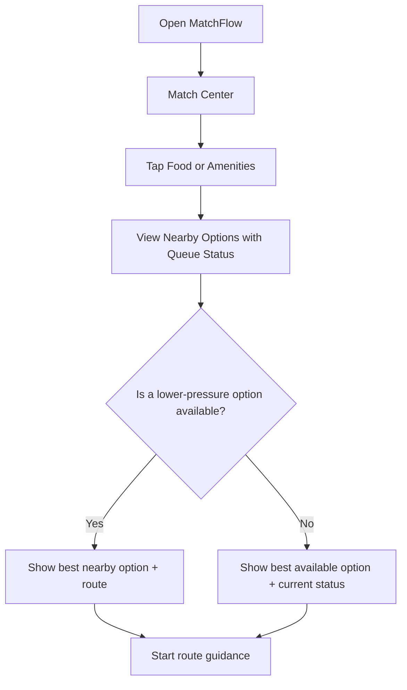
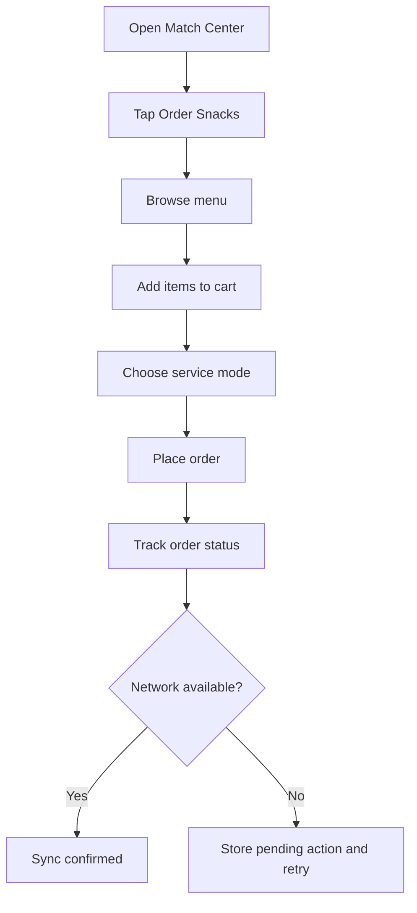
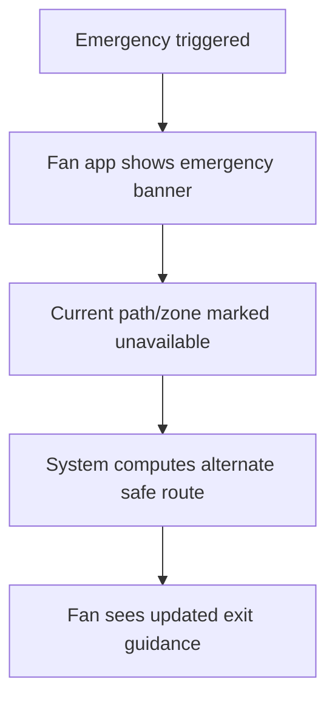
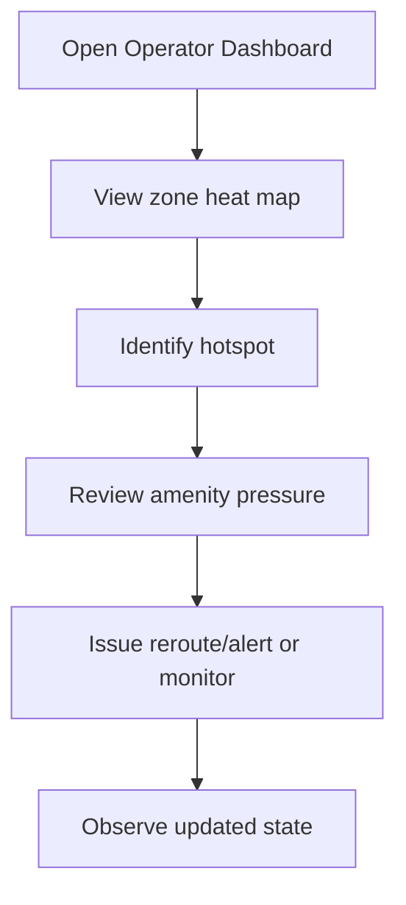
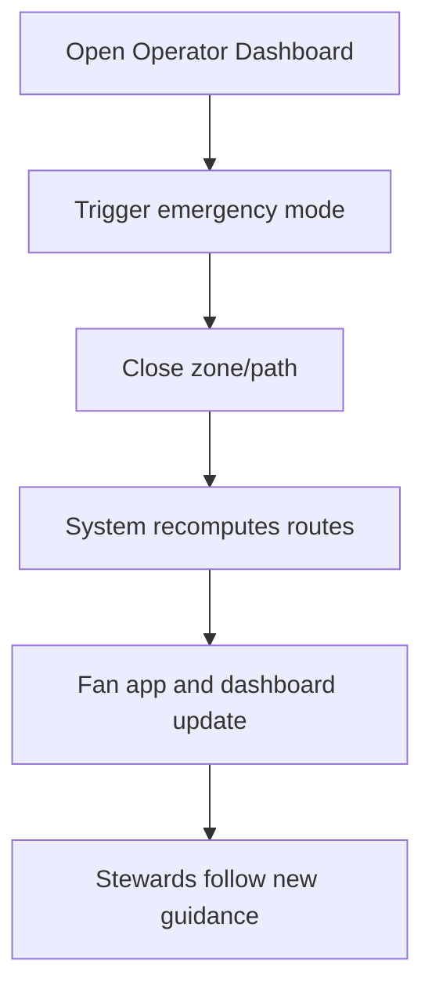

# MatchFlow Product Requirements Document (PRD)

## 1. Title & Metadata

| Field | Value |
|---|---|
| Document Title | MatchFlow Product Requirements Document |
| Product Name | MatchFlow |
| Version | v1.0 |
| Author | OpenAI ChatGPT |
| Status | Draft |
| Date | 2026-04-08 |
| Document Type | PRD |
| Related Documents | MatchFlow BRD, MatchFlow SRS, MatchFlow SDD, DESIGN.md |
| Primary Build Method | Spec-Driven Development (SDD) |
| Target Delivery Mode | 72-hour Smart Stadium MVP |

---

## 2. Product Objective / Goal

### Product Goal
MatchFlow is a cricket-aware smart stadium assistant designed to reduce crowd friction, improve fan convenience, support safer movement, and give stadium operators better real-time decision support during high-pressure match moments.

### What success looks like for the user

#### For fans
- They can quickly see the least crowded washrooms and concessions.
- They receive helpful routing guidance during innings breaks and post-match exits.
- They can place in-seat snack orders instead of entering a congested concourse.
- They continue to get usable guidance even if stadium connectivity becomes weak.
- They receive clear, trusted emergency instructions if a route or zone becomes unavailable.

#### For operators
- They can identify crowd hotspots in near real time.
- They can view queue pressure across zones and amenities.
- They can trigger operational interventions such as reroutes, alerts, and closures.
- They can simulate major surge moments for demo and validation.
- They can maintain a believable, usable control plane for crowd flow management during cricket-specific surges.

### Product success statement
A successful MatchFlow MVP demonstrates that a stadium can use zone-level real-time intelligence, queue-aware guidance, and safety-first routing to improve both fan experience and operational control during predictable cricket crowd surges.

---

## 3. Background / Product Context

Cricket stadiums experience intense but predictable crowd surges during moments such as innings breaks, DRS decisions, wickets, and the end of the match. These moments create long queues, concourse bottlenecks, uneven crowd distribution, missed concession opportunities, and potential safety issues.

MatchFlow is being built as a focused smart stadium MVP for large venues such as Narendra Modi Stadium, Eden Gardens, and similar high-capacity venues. The product is intended to demonstrate a practical and believable operational solution rather than an overbuilt full-production platform.

The current project direction is to deliver:
- a fan-facing mobile-first PWA
- an operator dashboard
- a real-time zone heat map
- queue alerts and least-crowded suggestions
- in-seat ordering
- emergency rerouting using a simplified digital twin
- offline-first degraded-mode behavior
- a simulator for demo scenarios

This PRD converts the agreed MatchFlow concept into product-facing requirements, user journeys, feature behavior, and acceptance criteria.

---

## 4. Product Principles

1. **Cricket-aware by design**  
   The product should feel purpose-built for cricket stadium surge patterns, not like a generic venue app.

2. **Utility over novelty**  
   Every major feature should help a fan move faster, decide faster, or stay safer.

3. **Operator clarity under pressure**  
   The dashboard should favor fast scanning, clear priorities, and low-friction interventions.

4. **Believable MVP scope**  
   The product must stay focused on demo credibility and avoid features that depend on heavy hardware or full enterprise complexity.

5. **Offline-first resilience**  
   The app should remain useful under weak connectivity.

6. **Accessibility is mandatory**  
   The product must remain readable and actionable in bright, noisy, crowded stadium conditions.

---

## 5. User Personas

### Persona 1 — Fan Farhan
**Type:** Stadium attendee / end user  
**Profile:** A cricket fan attending a live match with limited patience for queues and limited attention during fast-moving game moments.  
**Goals:**
- Find the fastest route to amenities.
- Avoid missing important match moments.
- Order food conveniently.
- Exit safely and quickly after the match.
- Get clear, simple guidance even with weak network connectivity.

**Pain Points:**
- Doesn’t know which concession or washroom has the shortest queue.
- Gets stuck in crowd surges during innings breaks.
- Loses time navigating unfamiliar stadium zones.
- May abandon food purchase due to crowding.
- Needs very simple instructions under pressure.

### Persona 2 — Operator Oviya
**Type:** Stadium operations controller / command center user  
**Profile:** A stadium operations team member responsible for crowd flow, queue management, and incident response.  
**Goals:**
- Monitor zone congestion and amenity pressure.
- Identify emerging hotspots quickly.
- Issue routing or queue guidance interventions.
- Trigger emergency closures or reroutes when needed.
- Maintain control during innings break and end-of-match rush.

**Pain Points:**
- Has limited real-time visibility into fan movement.
- Needs a quick way to act without navigating heavy back-office workflows.
- Must respond fast during spikes.
- Needs confidence that the displayed state is current enough to act on.

### Persona 3 — Steward Sameer
**Type:** On-ground event/steward support user  
**Profile:** A staff member near gates, corridors, or concourses who supports fan movement and follows operator instructions.  
**Goals:**
- Understand closures and rerouting directions.
- Help fans follow the safest route.
- Receive simple, clear instructions from operations.

**Pain Points:**
- Needs operational clarity in high-noise, high-pressure situations.
- May need to act with partial connectivity.

### Persona 4 — Vendor Vani
**Type:** Concession operations stakeholder  
**Profile:** A concession partner or venue food operator interested in reducing abandoned purchases and improving throughput.  
**Goals:**
- Increase order conversion.
- Reduce pressure on overcrowded counters.
- Support pickup or in-seat fulfillment in a controlled way.

**Pain Points:**
- Demand spikes are bursty and uneven.
- Long queues reduce sales and customer satisfaction.

---

## 6. User Stories

### Fan stories
1. As **Fan Farhan**, I want to see nearby washrooms and concessions with current queue conditions so that I can choose the fastest option.
2. As **Fan Farhan**, I want the app to suggest a less crowded route during innings break so that I can reach an amenity faster.
3. As **Fan Farhan**, I want to order snacks from my seat so that I can avoid leaving during a critical match moment.
4. As **Fan Farhan**, I want the app to continue showing last-known guidance offline so that it remains useful in a congested network environment.
5. As **Fan Farhan**, I want the app to show emergency exit guidance if a path is closed so that I can leave safely.
6. As **Fan Farhan**, I want clear freshness indicators on live data so that I can decide whether to trust the displayed queue or route guidance.
7. As **Fan Farhan**, I want match-aware notifications at key moments so that I can make better timing decisions.

### Operator stories
8. As **Operator Oviya**, I want to monitor zone density and amenity pressure in near real time so that I can identify crowd hotspots before they worsen.
9. As **Operator Oviya**, I want to issue queue-aware rerouting guidance so that fan traffic is better distributed.
10. As **Operator Oviya**, I want to view a simplified digital twin with closures and routes so that I can manage crowd flow safely.
11. As **Operator Oviya**, I want to trigger emergency mode and close a zone/path so that safe alternative routes are shown immediately.
12. As **Operator Oviya**, I want a simulator that can generate innings break, DRS, wicket, end-match, and emergency scenarios so that the product can be validated and demoed credibly.

### Steward stories
13. As **Steward Sameer**, I want to view reroute instructions during a closure so that I can guide fans accurately.

### Concession/Vendor stories
14. As **Vendor Vani**, I want in-seat order demand to route through a manageable order flow so that service remains believable in the MVP.

---

## 7. High-Level Scope

### In Scope for this PRD / MVP
- Fan-facing PWA
- Operator dashboard
- Venue domain model at zone level
- Real-time heat map and density view
- Queue alerts for washrooms and concessions
- Least-crowded nearby amenity suggestions
- Dynamic rerouting during innings break and other surge windows
- End-of-match exit guidance
- In-seat snack ordering
- Match-aware alerts and notifications
- Emergency rerouting using simplified digital twin logic
- Offline-first degraded behavior
- Synthetic simulator for demo scenarios

### Out of Scope for this PRD / MVP
- Full CCTV or computer vision pipeline
- Real sensor hardware dependency
- Full CAD/BIM digital twin
- Full payment gateway integration
- Production indoor positioning system
- Seat-level live person tracking
- Full enterprise ERP/back-office operations suite
- Advanced concession OMS/WMS integrations
- Full incident management workflow suite beyond essential controls

---

## 8. Functional Requirements

### FR-01 Venue Domain Model
The system shall model the stadium as zones, paths, gates, amenities, capacities, and route relationships.

**Behavior**
- Each zone shall have an identifier, name, type, capacity, and status.
- Each path shall connect two or more route nodes and support open/closed state.
- Amenity nodes shall represent washrooms and concessions with queue-related state.
- The model shall support route computation across the graph.
- The model shall support dynamic closures for emergency and operational rerouting.

### FR-02 Fan App Shell
The system shall provide a mobile-first fan experience optimized for quick use in a live stadium context.

**Behavior**
- Fan app shall open into a match-aware home or match center experience.
- Fan app shall show nearby amenities and utility shortcuts.
- Fan app shall support venue map and route guidance views.
- Fan app shall support live alert display.
- Fan app shall preserve essential state for offline usage.

### FR-03 Live Heat Map
The system shall compute and display zone-level live crowd state.

**Behavior**
- Each zone shall expose density score, flow direction, entry rate, exit rate, queue pressure, status band, timestamp, and confidence where applicable.
- Operator dashboard shall visualize congestion bands by zone.
- Update cadence shall increase during surge windows.
- Fan-facing views may show simplified localized crowd guidance instead of full operational detail.

### FR-04 Queue Alerts and Amenity Guidance
The system shall provide centrally computed amenity wait-time state for fan decisions.

**Behavior**
- Queue alerts shall show approximate wait condition for concessions and washrooms.
- Fan app shall show least-crowded nearby suggestions when available.
- Exact minutes may degrade to low/moderate/high bands under stale data conditions.
- Freshness of the information shall be visible.
- Queue recommendations shall prefer cached live state rather than aggressive client polling.

### FR-05 Dynamic Rerouting
The system shall suggest alternate routes when crowd pressure rises or routes become unsuitable.

**Behavior**
- During innings break or other surge windows, fan-facing navigation shall recommend lower-pressure paths where available.
- During end-of-match dispersal, exit guidance shall prioritize safe and lower-pressure movement.
- Rerouting logic shall operate on the simplified route graph.
- If no better route exists, the system shall still provide the best available route with a clear status indication.

### FR-06 In-Seat Ordering
The system shall allow fans to place snack orders in a lightweight MVP flow.

**Behavior**
- Fan user shall browse a limited menu.
- Fan user shall add items to cart and place an order.
- Order shall support a believable service mode such as pickup or in-seat delivery depending on MVP configuration.
- Order status shall be trackable through simple states.
- Queue-aware service choices may be presented where relevant.
- Payment may be mocked or simulated if needed for the MVP.

### FR-07 Match-Aware Notifications
The system shall surface contextual messages that help fans decide when to move.

**Behavior**
- Notifications may be triggered by innings break, DRS, wickets, congestion spikes, route closures, or emergency events.
- Fan-facing messaging shall be brief and action-oriented.
- Notifications shall avoid excessive noise.
- Operator-triggered alerts shall override optional informational notifications when necessary.

### FR-08 Emergency Rerouting and Digital Twin Controls
The system shall support simplified emergency operations using graph-based closures and reroutes.

**Behavior**
- Operator shall be able to trigger emergency mode.
- Operator shall be able to close a zone or path.
- System shall recompute safe routes using current closure state.
- Fan-facing app shall display emergency banners and updated guidance.
- Steward/operator views shall reflect rerouted flow.

### FR-09 Offline-First Behavior
The system shall remain usable under degraded connectivity for critical user flows.

**Behavior**
- App shell, venue map basics, seat/stand context, saved routes, and last-known amenity data shall remain available from local cache.
- User actions such as order intent may be stored in an outbox when immediate sync is unavailable.
- App shall display last-updated time or stale state messaging.
- Safety guidance shall remain prioritized even in degraded mode.

### FR-10 Demo Simulator
The system shall include a simulator to generate believable event patterns for testing and presentation.

**Behavior**
- Simulator shall support at minimum: innings break rush, DRS spike, wicket surge, end-match exit surge, and emergency closure scenario.
- Simulator shall influence zone state and amenity pressure.
- Operator shall be able to switch or trigger demo scenarios.
- The simulator shall be sufficient to validate and showcase crowd-aware product behavior without physical hardware.

### FR-11 Operator Dashboard
The system shall provide an operator control interface for real-time monitoring and action.

**Behavior**
- Dashboard shall show zone congestion overview.
- Dashboard shall show amenity pressure or wait-state overview.
- Dashboard shall show alerts or operational state indicators.
- Dashboard shall support actions such as issue guidance, trigger closure, or activate emergency state.
- Dashboard shall favor fast scanning and low interaction friction.

### FR-12 Role and Access Behavior
The system shall distinguish fan-facing and operator-facing functionality.

**Behavior**
- Operator actions shall require authenticated access.
- Fan users shall only see public or end-user-safe views.
- Emergency controls and route closures shall not be executable from fan context.

---

## 9. Detailed Acceptance Criteria

### AC-01 Venue Domain Model
- Stadium map data can represent zones, paths, gates, and amenities.
- At least one valid route can be computed between a stand context and a target amenity or exit.
- Closure of a path or zone causes route output to change when an alternative exists.
- No seat-level live tracking is required for the MVP.

### AC-02 Fan App Shell
- Fan app is mobile-first and usable on small screens.
- A user can access match center, map/route guidance, amenities, and order flow from the main shell.
- Essential fan context persists across refresh or reconnection.

### AC-03 Live Heat Map
- Operator view shows zone-level status using clear visual bands.
- Heat data updates during simulated surge events.
- Data freshness is visible to users where relevant.
- UI does not rely on color alone to convey state.

### AC-04 Queue Alerts
- Fan user can view queue information for nearby washrooms and concessions.
- At least one least-crowded recommendation can be shown when alternatives exist.
- Stale precise wait time degrades to a coarser band rather than failing silently.
- Queue state is derived centrally, not via excessive client polling behavior.

### AC-05 Dynamic Rerouting
- During a simulated innings break surge, a fan route can change to a lower-pressure alternative when one exists.
- During end-match simulation, exit guidance is available.
- Reroute instructions are understandable within a few seconds of reading.

### AC-06 In-Seat Ordering
- Fan can browse a basic menu and place an order in the MVP flow.
- Order enters a visible tracking state after placement.
- If connectivity drops before sync, pending action handling is clear and recoverable.
- Full live payment is not required.

### AC-07 Notifications
- Fan user receives at least one contextual actionable notification during simulation scenarios.
- Messages are short and understandable.
- Emergency messages take precedence over convenience notifications.

### AC-08 Emergency Mode
- Operator can activate emergency mode.
- One or more zones/paths can be marked closed.
- Fan guidance changes in response.
- Dashboard and fan app both reflect emergency state consistently.

### AC-09 Offline-First
- Fan can reopen the app without network and still see cached core information.
- Last-known queue and route information remains visible with freshness messaging.
- Pending user actions can retry on reconnect.
- Critical safety guidance remains available in degraded mode.

### AC-10 Simulator
- Each required scenario can be triggered and visibly affects the UI.
- Demo flows remain stable during simulator activity.
- Simulator can be used for manual validation of route, queue, and emergency behavior.

### AC-11 Operator Dashboard
- Operator can identify top hotspots quickly without deep navigation.
- Operator can initiate at least one intervention from the dashboard.
- Dashboard remains readable under high event activity.

### AC-12 Accessibility
- Important text remains readable in a bright-use context.
- Interactive targets are comfortably tappable or clickable.
- Status communication is not color-only.
- Loading, offline, alert, and emergency states are clearly distinguishable.

### AC-13 Security and Control Credibility
- Protected controls are not available to fan users.
- Operator-only actions are visibly authenticated/controlled.
- Dangerous actions such as emergency controls are not trustable from client-only authority.

---

## 10. User Flows & Wireframes

### 10.1 Fan Flow — Find the Least Crowded Concession



### 10.2 Fan Flow — In-Seat Ordering



### 10.3 Fan Flow — Emergency Reroute



### 10.4 Operator Flow — Manage Surge Conditions



### 10.5 Operator Flow — Emergency Closure



### 10.6 Low-Fidelity Wireframes

#### Fan app home / match center
```text
+------------------------------------------------+
| MatchFlow                                      |
| Live Match: Team A vs Team B                   |
| ---------------------------------------------- |
| [Queue Alerts]  [Order Snacks]  [Find Route]   |
|                                                |
| Nearby Amenities                               |
| - Washroom North: Moderate (2 min ago)         |
| - Snack Bay 3: High                            |
| - Snack Bay 1: Low  -> Recommended             |
|                                                |
| Smart Prompt                                   |
| "Bay 1 is less crowded. 3 min walk via Gate C"|
|                                                |
| [Open Map] [Start Route]                       |
+------------------------------------------------+
```

#### Fan route screen
```text
+------------------------------------------------+
| Route to Snack Bay 1                           |
| ---------------------------------------------- |
| Current status: Preferred route                |
| ETA: 3 min                                     |
| Crowd pressure: Low                            |
| Updated: 15 sec ago                            |
|                                                |
| [Map / path visualization area]                |
|                                                |
| Alternate route available: No                  |
| [Back]                         [Start Walking] |
+------------------------------------------------+
```

#### Fan emergency screen
```text
+------------------------------------------------+
| EMERGENCY GUIDANCE                             |
| ---------------------------------------------- |
| Zone near Gate B is temporarily closed.        |
| Follow the highlighted route to Exit Gate D.   |
|                                                |
| [Map / safe exit route]                        |
|                                                |
| [Acknowledge]              [View steps again]  |
+------------------------------------------------+
```

#### Operator dashboard
```text
+--------------------------------------------------------------+
| MatchFlow Ops Dashboard                                      |
|--------------------------------------------------------------|
| Zones: [North Stand: Amber] [Food Court East: Red] [Gate C]  |
|                                                              |
| Hotspots                                                     |
| 1. Food Court East - High queue pressure                     |
| 2. Washroom South - Rising density                           |
|                                                              |
| Actions                                                      |
| [Issue Reroute] [Send Alert] [Close Path] [Emergency Mode]   |
|                                                              |
| Simulator                                                    |
| [Innings Break] [DRS Spike] [Wicket Surge] [Exit Rush]       |
+--------------------------------------------------------------+
```

---

## 11. Feature Prioritization

### P0 — Must Have for MVP
- Venue domain model
- Fan app shell
- Operator dashboard
- Live heat map
- Queue alerts
- Dynamic rerouting
- End-match exit guidance
- Emergency rerouting
- Offline-first essential behavior
- Demo simulator

### P1 — Strong Differentiators
- In-seat ordering
- Match-aware notifications
- Confidence/freshness indicators
- Least-crowded recommendations

### P2 — Nice to Have if Time Permits
- Richer personalization by stand/seat context
- Expanded operator analytics panels
- Deeper order fulfillment detail
- Replay or historical view of simulated flows

---

## 12. Non-Functional Product Requirements

### Usability
- Fan flows must be understandable within seconds.
- Operator dashboard must be scannable without deep navigation.

### Accessibility
- High contrast UI.
- Large tap targets.
- Non-color-only state indication.
- Clear offline and emergency messaging.

### Performance
- Live updates should feel responsive in demo scenarios.
- Payloads should remain lightweight.
- UI should not degrade noticeably during surge simulations.

### Reliability
- Product should remain demo-ready throughout the build.
- Degraded mode should preserve usefulness even with stale data.

### Security
- Operator controls must be protected.
- Sensitive actions must be validated server-side.
- Secrets must not be exposed in client code.

### Maintainability
- Requirements should be implementable in modular specs.
- Features should be broken into small, verifiable slices.

---

## 13. Analytics / KPIs

### Fan Experience KPIs
- % of users selecting a recommended lower-pressure amenity
- Average time from app open to route start
- In-seat order initiation rate
- In-seat order completion rate
- % of sessions where cached guidance is still usable offline
- Alert interaction rate

### Operations KPIs
- Time to identify hotspot after simulated surge begins
- Time from hotspot detection to operator intervention
- % of reroute actions reflected correctly in fan view
- Emergency reroute propagation time across dashboard and fan UI

### Business / Demo KPIs
- Reduction in simulated amenity congestion in redirected zones
- Increase in simulated concession conversion via in-seat ordering path
- Stability of app during surge scenarios
- Completion rate of end-to-end demo flows
- Accessibility validation pass rate across core screens

### Product Validation KPIs for the MVP
- All P0 flows demonstrated successfully
- At least one “wow moment” works reliably: live reroute, least-crowded recommendation, emergency reroute, or graceful degraded mode
- Manual validation passes for innings break, DRS, exit rush, and emergency scenario

---

## 14. Release Scope for MVP Demo

The demo release should prove the following product outcomes:
1. Fans can make faster movement decisions with live queue and routing guidance.
2. Operators can see and react to crowd pressure in near real time.
3. The product can stay useful when connectivity weakens.
4. Emergency guidance can override normal convenience flows.
5. MatchFlow feels like a practical Google-native smart stadium solution rather than a static mockup.

---

## 15. Dependencies and Assumptions

### Assumptions
- Event inputs may be synthetic or mocked for the MVP.
- Stadium map will be simplified into zones, paths, and amenities.
- Seat-level live tracking is not required.
- Payment may be simulated.
- Simulator-driven validation is acceptable for judging/demo purposes.

### Dependencies
- Approved venue domain model
- UI direction from Google Stitch / DESIGN.md
- Google-native backend setup for live state and messaging
- Simulator event generation
- Role-aware access model for fan vs operator actions

---

## 16. Risks to Product Success

1. **Scope expansion risk**  
   Too many features may reduce demo quality.

2. **Realtime credibility risk**  
   Poor simulator quality or inconsistent updates may weaken trust in the product.

3. **Connectivity risk**  
   If degraded mode is not handled well, the stadium-use case becomes less convincing.

4. **UX overload risk**  
   Too much information could make the app harder to use under pressure.

5. **Emergency-flow inconsistency risk**  
   If operator actions and fan guidance drift out of sync, the safety story becomes weak.

---

## 17. Definition of Done for the PRD

This PRD is considered actionable when:
- core personas are defined
- MVP user stories are documented
- feature requirements are written clearly
- acceptance criteria are testable
- user flows and low-fidelity wireframes are available
- KPIs are defined for demo and validation
- the document can be used as the product source of truth for the next SRS and feature specs

---

## 18. Recommended Next Documents

1. MatchFlow SRS
2. MatchFlow SDD / architecture note
3. DESIGN.md from Stitch outputs
4. Initial feature specs:
   - 01-venue-domain-model
   - 02-fan-app-shell
   - 03-live-heatmap
   - 04-queue-alerts
   - 05-in-seat-ordering
   - 06-emergency-reroute
   - 07-offline-sync
   - 08-demo-simulator

---

## 19. Appendix — Mapping to Judging Expectations

| Judging Lens | MatchFlow Product Response |
|---|---|
| Instructions | MVP is tightly aligned to cricket-specific stadium pain points |
| Code Quality | PRD is modular and spec-ready for disciplined implementation |
| Security | Operator-only actions and protected emergency controls are explicit |
| Efficiency | Zone-level modeling, cached wait times, and lightweight payloads are built into the product design |
| Testing | Simulator and scenario-based acceptance criteria are part of the product definition |
| Accessibility | High contrast, low-friction, non-color-only UX is required |
| Google Services | Product assumes Google-native implementation path for realtime, notifications, assistant behavior, UI generation, and build workflow |

---

## 20. One-Line Product Positioning

**MatchFlow is a cricket-aware smart stadium assistant that helps fans move smarter and helps operators manage surges safely through live crowd intelligence, queue-aware guidance, in-seat ordering, and emergency-ready routing.**
